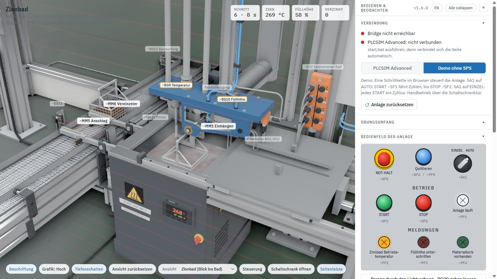
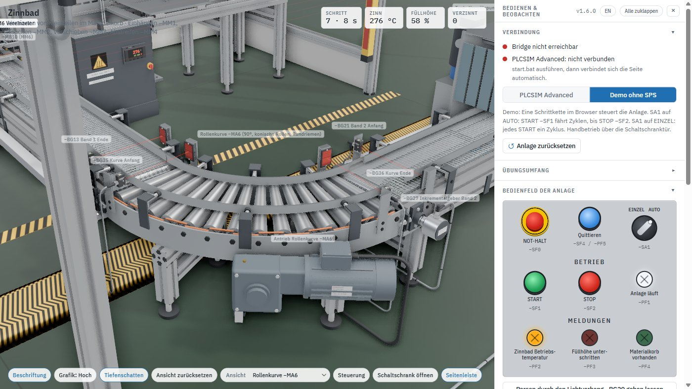
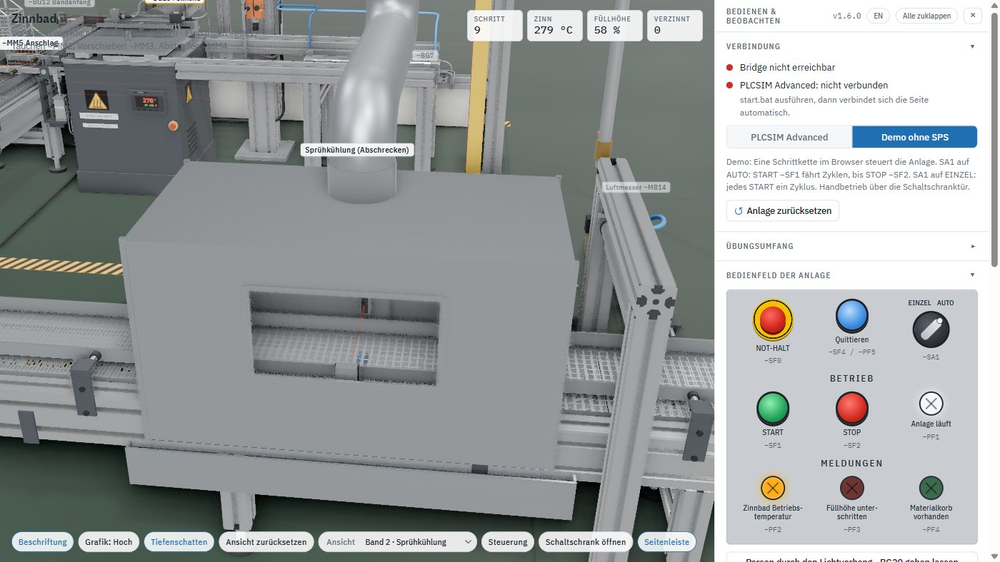
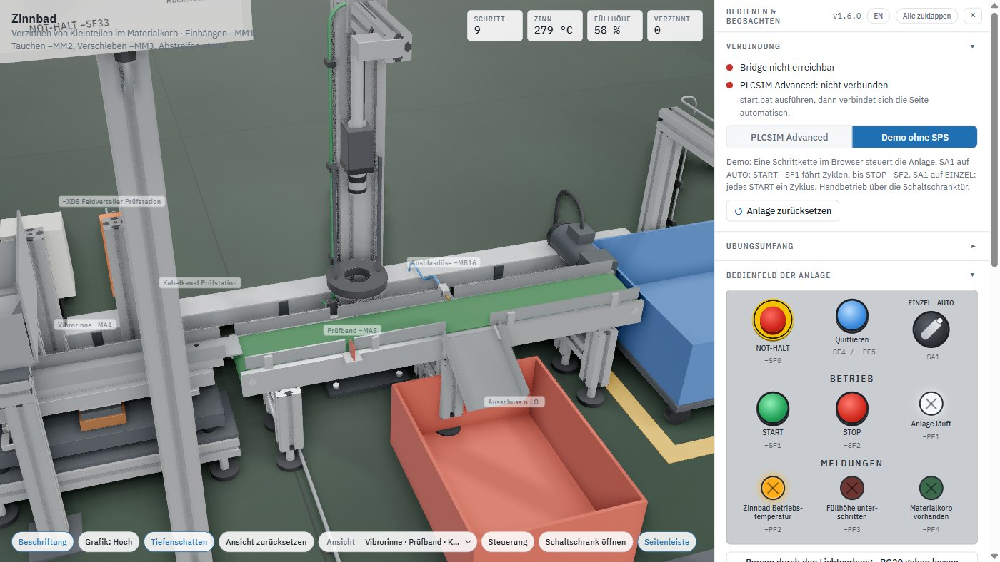
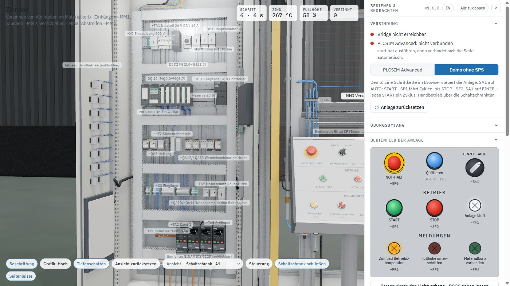
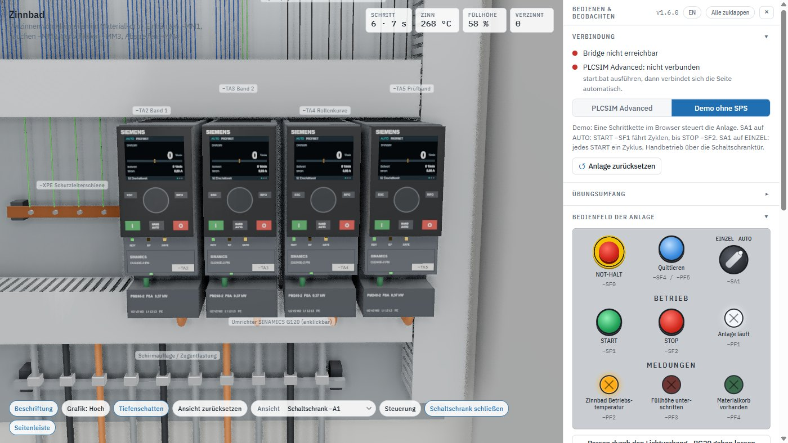

# Digitaler Zwilling – Verzinnungsanlage

**Eine komplette Industrieanlage im Browser, gekoppelt an eine virtuelle S7-1500.**
Dein TIA-Programm steuert sie über ganz normale Ein- und Ausgänge – ohne Hardware, ohne Risiko,
ohne Wartezeit am Prüfstand.

*Bauer Automation Solutions · Dennis Bauer · frei für Ausbildung und Lehre*


```
Browser (3D-Zwilling)  ⇄  WebSocket  ⇄  ZwillingBridge.exe  ⇄  PLCSIM-Advanced-API  ⇄  virtuelle S7-1500
   Endlagen, Lichtschranken, Taster, Wahlschalter, BT1/BL1  ───────►  %I / %IW
   Ventilspulen, Schütze, Heizung, Leuchten                 ◄───────  %Q
```

---

## In drei Schritten laufen lassen

```bat
1. Bridge\build.bat      :: findet die PLCSIM-API, baut ZwillingBridge.exe
2. Bridge\start.bat      :: startet Bridge und Webserver, öffnet den Browser
3. http://localhost:8181 :: −SA1 auf AUTO, START −SF1 drücken
```

**Nur anschauen?** `web\index.html` doppelklicken. Eine einzige Datei, kein Server, kein Internet,
keine Installation. Ohne SPS läuft die Betriebsart **Demo ohne SPS**: Eine Schrittkette im Browser
steuert die Anlage, sie fährt von selbst.

Die vollständige Inbetriebnahme mit TIA Portal und PLCSIM Advanced steht in
**[docs/01-inbetriebnahme.md](docs/01-inbetriebnahme.md)**.

---

## Was hier simuliert wird

Kleinteile werden im Materialkorb verzinnt. Die Anlage besteht aus sechs Stationen, die alle
zusammenhängen – ein Korb läuft vom Bandanfang bis in die Kiste durch:

| Station | Inhalt |
|---|---|
| **Zuführband 1** | Gurtförderer mit Antrieb −MA1, Inkrementalgeber, Anschlag −MM5 und Vereinzeler −MM6 (Schwenkhebel-Stopper), Vor-Ort-Steuerstelle −S10 |
| **Portal und Zinnbad** | Einhängen −MM1 (Schwenkhaken), Tauchen −MM2, Verschieben −MM3, Abstreifen −MM4; beheiztes Zinnbad 280 °C mit Füllstandsüberwachung und Nachfülleinrichtung |
| **90°-Rollenkurve −MA6** | Angetriebene Kurvenrollenbahn mit 14 konischen Tragrollen und Rundriemen, Vor-Ort-Steuerstelle −S30 |
| **Band 2 mit Sprühkühlung** | Edelstahl-Drahtgurt, Abschreck-Tunnel mit Umwälzpumpe und Sprührohren, Pyrometer −BT2, Luftmesser, Vor-Ort-Steuerstelle −S20 |
| **Korbkipper −MM8** | Angetriebene Kippmulde, 126° Kippwinkel, Schurre in den Trichter, Vor-Ort-Steuerstelle −S40; am Prüfband −S50 mit Drehzahlpotentiometer |
| **Prüfstation** | Vibrorinne, Prüfband, Keyence-Kamera je Teil, Ausblasdüse für n.i.O.-Teile, KLT mit Füllstandsüberwachung |

Dazu ein **Bedienpult**, ein begehbarer **Schaltschrank −A1** mit S7-1500, Schützen, Klemmen und
HMI-Panel, ein **Sicherheitskreis** mit fünf Not-Halt-Tastern, Sicherheitsrelais −KF2 und
Lichtvorhang – und ein Werker, der die fertigen Körbe abnimmt.

<table>
<tr>
<td width="50%"></td>
<td width="50%"></td>
</tr>
<tr>
<td></td>
<td></td>
</tr>
</table>

---

## Leistungsmerkmale

**155 Signale an frei wählbaren Adressen.** 104 Eingänge, davon 4 analog, und 51 Ausgänge auf
`%I0.0…%I11.7`, `%Q0.0…%Q5.3` und `%IW64…70`, dazu die PROFINET-Telegramme der vier Umrichter
−TA2…−TA5 (Band 1, Band 2, Rollenkurve, Prüfband) auf `%IW256…270/%QW256…270` – für
Technologieobjekte `TO_SpeedAxis` wie an echten SINAMICS G120. Dein Programm sieht dieselbe Schnittstelle wie an
der realen Anlage – kein proprietäres Protokoll, keine Bausteinbibliothek, keine Lizenzdatei.

**Verhaltensmodell statt Animation.** Zylinder fahren mit Schaltverzug, Beschleunigung und
Endlagendämpfung; an jedem sitzen Drosselrückschlagventile, Aus- und Einfahren getrennt einstellbar
bis zum Stillstand. Sensoren haben Schaltpunkt und Hysterese, Körbe stauen sich an ihren Stoßpuffern
mit 150 mm Teilung. Die Zinntemperatur folgt einer PT1-Kette (Heizelement 6 s → Bad 150 s); 100 %
Heizleistung ergeben 360 °C, für 280 °C sind rund 76 % nötig, jedes Tauchen kühlt um 5 K und
verbraucht 4 % Zinn. Eine Regelung, die hier steht, steht auch an der Anlage.

**Jedes Befehlsgerät ist bedienbar.** Taster, Not-Halt und Wahlschalter in der 3D-Szene anklickbar
und zusätzlich als Nachbau in der Seitenleiste. Der Schaltschrank lässt sich öffnen: Die Kanal-LEDs
der DI/DQ-Baugruppen zeigen live die Bits, die Schütze ziehen sichtbar an, das CPU-Display zeigt
RUN/STOP.

**Übungsumfang in Stufen.** Du legst fest, welchen Teil der Anlage dein Programm übernimmt: erst
die Schrittkette, dann die Förderstrecke mit Rollenkurve und Prüfstation, dann die
Temperaturregelung. Den Rest fährt das Modell selbst – die Anlage ist vom ersten Tag an vollständig.

**Diagnose an Bord.** Signalmonitor mit Forcen jedes einzelnen Eingangs, Weg-Zeit-Diagramm aller
sieben Zylinder mit Schrittnummern – groß im eigenen Fenster mit Messlinien, die an den
Endlagensensoren einrasten, und gemessener Fahrzeit je Zylinder und Richtung. Dazu eine
Ereignisliste im Klartext („Band 2 und Muldenrollen müssen laufen“, „Gutteil ausgeblasen“,
„Korb hängt an der Übergabe“).

**Deutsch und Englisch.** Die Oberfläche schaltet per Knopf zwischen Deutsch und Englisch um, und
die TIA-Variablentabelle gibt es mit deutschen und mit englischen Namen – bei gleichen Adressen,
denn die Bridge koppelt über die Adressen.

**Eine Datei, keine Installation.** Der Zwilling ist eine einzige HTML-Datei von 5 MB – kein Server,
kein Internet, keine Laufzeitumgebung. Die Grafikstufe regelt sich selbst nach der Bildrate, vom
Schulungslaptop bis zur Workstation; zuschaltbare Tiefenschatten (Ambient Occlusion) für eine noch
realistischere Darstellung.

<table>
<tr>
<td width="50%"></td>
<td width="50%"></td>
</tr>
<tr>
<td></td>
<td></td>
</tr>
<tr>
<td></td>
<td></td>
</tr>
</table>

---

## Für wen

- **Ausbildung und Weiterbildung** – Elektroniker für Automatisierungstechnik, Mechatroniker,
  Techniker- und Meisterschulen. Eine Anlage, die vom einfachen Schrittkettenprojekt bis zur
  Diplomarbeit trägt.
- **SPS-Schulungen** – Betriebsarten, Sicherheitstechnik, Handshakes, Analogwertverarbeitung und
  Regelung an einem durchgängigen Beispiel statt an fünf unverbundenen Übungsbrettern.
- **Programmierer** – Programme vorab testen, Störfälle provozieren, Überwachungszeiten
  auslegen, bevor die reale Anlage steht.

---

## Dokumentation

| Dokument | Inhalt |
|---|---|
| **[01 – Inbetriebnahme](docs/01-inbetriebnahme.md)** | Bridge bauen, TIA-Projekt vorbereiten, PLCSIM Advanced starten, koppeln, testen, Fehlersuche |
| **[02 – Die Anlage](docs/02-anlage.md)** | Konstruktion aller Stationen, Linie nach dem Verzinnen, Leitungsführung, Schaltschrank |
| **[03 – Bedienen](docs/03-bedienung.md)** | Bedienpult, Handbetrieb-Tableau, Vor-Ort-Steuerstellen, Not-Halt, Weg-Zeit-Diagramm und Drosseln, 3D-Navigation, Grafikstufen |
| **[04 – Signale und TIA](docs/04-signale.md)** | `signale.csv`, Adressbelegung, Bridge, Signalmonitor, Öffner und Schließer |
| **[05 – Übungsaufgaben](docs/05-uebungen.md)** | 16 Aufgaben vom Einstieg bis zur Taktzeitoptimierung, nach Schwierigkeit geordnet |
| **[06 – Entwicklung](docs/06-entwicklung.md)** | Build, Aufbau des Quellcodes, Werkzeuge, Konventionen |
| **[Änderungen](CHANGELOG.md)** | Was sich in welcher Version geändert hat |

---

## Projektstruktur

```
signale.csv                 Signalliste – die einzige Stelle mit Adressen
Bridge/
  build.bat                 baut ZwillingBridge.exe (C#-Compiler aus Windows)
  start.bat                 Instanzname, Port, CPU-Zykluszeit
  ZwillingBridge.cs         Quellcode der Bridge
TIA/
  PLC_Variablen_Zinnbad.xlsx  alle 155 Signale zum Import (deutsche Namen)
  PLC_Tags_Tinning_EN.xlsx    dieselben Signale mit englischen Namen
web/
  index.html                der fertige Zwilling – eine Datei, läuft per Doppelklick
  src/                      Quellcode als ES-Module
  build.mjs                 Bündelung mit esbuild
  tools/                    Screenshot- und Importzyklus-Prüfung
docs/                       Dokumentation und Bilder
```

---

## Systemvoraussetzungen

| | |
|---|---|
| **Anschauen** | Windows, macOS oder Linux, aktueller Browser mit WebGL 2 |
| **Mit SPS** | Windows 10/11, S7-PLCSIM Advanced V3.0 oder neuer, TIA Portal V16 oder neuer |
| **Hardware** | Jede Grafik ab Intel UHD; die Grafikstufe regelt sich automatisch nach der Bildrate |
| **Keine** | Installation, Internetverbindung, Lizenzdatei oder Laufzeitumgebung für den Zwilling selbst |

---

## Lizenz

© 2026 **Bauer Automation Solutions**, Dennis Bauer — siehe [LICENSE](LICENSE).

**Für Ausbildung und Lehre frei.** Nutzen, anpassen und weitergeben in Berufsschulen, Hochschulen,
überbetrieblichen Ausbildungsstätten und in der innerbetrieblichen Ausbildung — unentgeltlich.
Eine Schulung darf Geld kosten; der Zwilling nicht.

**Nicht erlaubt:** Verkauf, Vermietung oder Unterlizenzierung des Zwillings, einzeln oder als
Bestandteil eines anderen Produkts. Bei Weitergabe bitte nennen:
*Digitaler Zwilling Verzinnungsanlage © Bauer Automation Solutions, Dennis Bauer.*
Für alles darüber hinaus gibt es eine Lizenzvereinbarung — frag einfach an.

Der Zwilling verwendet [three.js](https://threejs.org) und
[three-mesh-bvh](https://github.com/gkjohnson/three-mesh-bvh) unter MIT-Lizenz sowie die Schrift
[IBM Plex](https://github.com/IBM/plex) unter SIL Open Font License; die Lizenztexte liegen in
`web/src/lib/`. SIMATIC, TIA Portal, S7-1500 und PLCSIM sind Marken der Siemens AG;
Keyence, Festo, Rittal, Interroll und ifm sind Marken der jeweiligen Hersteller. Dieses Projekt
steht in keiner Verbindung zu diesen Unternehmen – die Betriebsmittel sind nachgebildet, damit die
Anlage aussieht und sich verhält wie eine reale Maschine.
