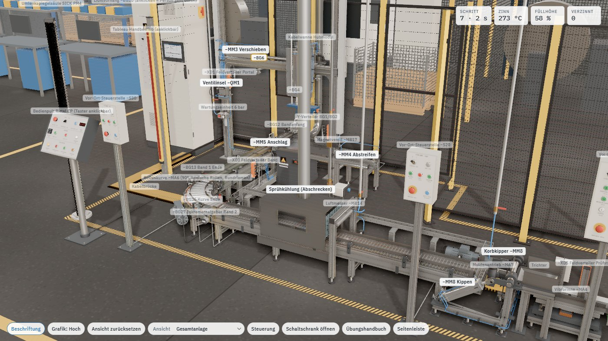

# Die Anlage

Was im Zwilling steht – Konstruktion, Linie, Leitungsführung und Schaltschrank. Alle Bauteile tragen
ihre Betriebsmittelkennzeichen nach EN 81346, so wie sie auch in `signale.csv` und im TIA-Projekt heißen.

[◀ Zurück zur Übersicht](../README.md)

## Konstruktion

- **Portal:** Säulen 90×90 unter der Traverse, Knotenbleche vorn/hinten, Traverse mit zwei Profilschienenführungen, Wagen mit −MM3 (ISO 15552), Endanschläge mit Stoßdämpfern, Energiekette in der Kettenwanne.
- **−MM2 Tauchen:** Führungseinheit mit zwei Führungsstangen in Linearlagern, Stange über Ausgleichskupplung am Joch.
- **Korbaufnahme (Schwenkhaken):** Adapterplatte am Joch, zwei Lagerböcke mit Gleitlagern, gelagerte Hakenwelle (Drehpunkt) mit zwei J-Haken (Sitzmulde und Sicherungsnase). Ein Hebel geht nach oben, −MM1 (Ø25, Hub 25) sitzt mit Schwenkbefestigung am Lagerbock und mit Gabelkopf am Hebel. Einfahren (−BG1) schwenkt die Haken unter den Korbbügel (Ø10), Ausfahren (−BG2) schwenkt sie frei. Hakenwinkel und Zylinderneigung werden aus dem Kolbenweg berechnet.
- **−MM4 Abstreifen:** Abdeckung auf zwei Profilschienenführungen (Baugröße 15) auf eigenem Gestell.
- **Materialkorb:** Edelstahl-Drahtkorb 110 × 90 × 110 mm, oben offen: Randrahmen und Eckstäbe Rundstahl Ø6, Drahtgitter Ø2,5 mit 13 mm Masche, Kufen aus Flachstahl mit PU-Stoßpuffern, Tragbügel Ø10 in 158 mm Höhe mit Stütz- und Diagonalstreben. Im Lochblech-Zwischenboden stecken **36 Kupfer-Rohrkabelschuhe** (Rohr Ø8, Lasche mit Loch Ø5) auf festen Plätzen im Raster 6 × 6 (Teilung 15 mm); Ablauflöcher dazwischen lassen Zinn und Wasser ablaufen.
- **Bandförderer:** Gurtband auf Gleitblech, Antriebstrommel mit Aufsteckgetriebemotor und Drehmomentstütze, Umlenktrommel, Flanschlager, Stützrollen, Seitenführungen. Anschlag −MM5 und Vereinzeler −MM6 als **Schwenkhebel-Stopper** seitlich auf der Antriebsseite (+x): Beim Edelstahl-Drahtgurt ist ein Hubstopper von unten durch den Gurt nicht möglich, deshalb greift ein Hebel (Flachstahl 16 × 12) über die Seitenführung hinweg an die Korbstirnwand (48…64 mm über dem Gurt). Er schwenkt quer zum Band in seiner eigenen Ebene um 49° nach oben auf und fährt dabei nie in einen Korb; der Vereinzelerhebel greift in die 40-mm-Lücke zwischen den gestauten Körben. Der Korb läuft gegen eine gedämpfte Anschlagleiste (PE-UHMW auf Alu-Träger, zwei Führungsbolzen, Industrie-Stoßdämpfer M12 neben dem Korb, Resthub 3 mm). Antrieb je ein Kompaktzylinder Festo ADN-20-40, senkrecht und fest auf einer Alu-Konsole an der Profilnut, mit Gabelkopf und Bolzen in der Kulisse (Langloch) der Kurbel r = 35 mm. Die Endlagen melden Nutsensoren SMT-8M am Zylinder (−BG14/−BG15, −BG16/−BG17) über den Feldverteiler −XD3, die Ventile −MB9/−MB10 sitzen auf −QM2. Der Korb wird erst ab 80 % Öffnungswinkel freigegeben, dann ist der Hebel schon über Korbrand und Tragbügel. Im Übungsumfang „automatisch“ fahren sie mit dem Bandmodul, sonst aus der SPS. Stirnanschläge an beiden Enden. Die Körbe haben Stoßpuffer am Bodenrahmen: Im Stau stehen sie mit 150 mm Teilung, sodass der Vereinzelerhebel in die 40-mm-Lücke zwischen den Korbkörpern greift. Inkrementalgeber −BG18 an der Umlenktrommel: 10 Impulse/Umdrehung, Spur A/B um 90° versetzt (vorwärts: B = 1 bei steigender Flanke A), Nullimpuls N, 24,5 mm Bandweg je Impuls. Am Bandende nimmt der Werker fertige Körbe nach 4 s ab.

## Linie nach dem Verzinnen (Band 2)

- **Band 1** ragt vorn aus der Umhausung (Antrieb −MA1 am Bandanfang, Geber −BG18 an der Kopftrommel, −BG13 als Reflexionslichtschranke kurz vor dem Bandende, z = 1005) und übergibt direkt an die Rollenkurve.
- **90°-Übergabe: angetriebene Kurvenrollenbahn −MA6** (Bauart wie Interroll-Kurvenmodule, für die kleinen Körbe verkleinert): 14 konische Tragrollen (Ø24 innen → Ø43 außen, Kegelspitze im Kurvenmittelpunkt, dadurch gleiche Winkelgeschwindigkeit über die Bahnbreite), Innenradius ca. 300 mm, Bahnbreite 254 mm, Mittellinie R = 420 mm (660 mm Förderweg, 110 mm/s). Antrieb: Aufsteckgetriebemotor −MA6 außen in Kurvenmitte, Rundriemen auf die mittlere Rolle, von dort PU-Rundriemen Ø5 von Rolle zu Rolle (Rundriemenköpfe am Außenende). Gebogene Seitenwangen (Stahl verzinkt), Seitenführungen (Edelstahl) an Haltern, zwei Stützen mit Traverse und Stellfüßen. Wendeschützkombination **−QA10/−QA11** und Motorschutz **−FA7** im Schaltschrank (Reihe D), Lichtschranken **−BG35** (Kurvenanfang) und **−BG36** (Kurvenende), Vor-Ort-Steuerstelle **−S30**. Der Korb folgt dem Bogen und dreht sich dabei um 90°.
- **Übergaben:** An jeder Stoßstelle (Band 1 → Kurve, Kurve → Band 2) liegt der Korb auf beiden Förderern und bewegt sich nur, wenn beide in dieselbe Richtung laufen. Die SPS muss also einen Handshake fahren: Band 1 läuft mit, solange die Kurve den Korb übernimmt (−BG13 oder −BG35 belegt), und der Korb am Kurvenende (−BG36) wartet, bis Band 2 läuft und −BG21 frei ist. Hängt ein Korb länger als 4 s an einer Übergabe, meldet der Zwilling das in der Ereignisliste. Im Stau stehen die Körbe mit 150 mm Teilung, auch in der Kurve und auf Band 2 (Kufen jetzt in Förderrichtung).
- **Lichtschranken an den Übergängen:** An jeder Übergabe sitzt eine Lichtschranke kurz vor dem Ende des abgebenden Förderers („Korb an der Übergabe“, der wartende Korb unterbricht den Strahl sicher) und eine kurz nach dem Anfang des aufnehmenden („Korb übernommen“). Keyence PZ-G61CN mit Reflektor R-2, beide auf Edelstahl-Haltewinkeln außen in der Profilnut der Seitenprofile (an der Kurve außen an den gebogenen Seitenwangen, zwischen zwei Tragrollen), nichts steht auf dem Gurt oder in der Korbbahn. Der Strahl liegt quer zur Förderrichtung (in der Kurve radial durch die Korbmitte) 50 mm über Gurt bzw. Rollenoberkante: über den Seitenführungen (Oberkante 43 mm), im Drahtkorb (Korbkörper 6…90 mm), unter Rand und Bügel. Das Signal ist 1, solange der Korbkörper (110 mm, Korbmitte ±55 mm um den Strahl) im Strahl steht. Zwischen den Strahlen einer Übergabe bleibt eine Lücke von 22…35 mm, die das Programm mit einer kurzen Nachlaufzeit oder einem Merker (gesetzt am abgebenden, zurückgesetzt am aufnehmenden Sensor) überbrückt.

| Lichtschranke | Signal / Adresse | Strahl (Korbmitte) | Bedeutung |
|---|---|---|---|
| −BG12 | BG12_Bandanfang %I2.5 | Band 1, z = −700 | Korb am Bandanfang (Zufuhr) |
| −BG11 | BG11_Korb %I1.2 | Band 1, z = 0 | Korb am Übergabeplatz (Anschlag −MM5) |
| −BG13 | BG13_Bandende %I2.6 | Band 1, z = 1005 (Haltewinkel vor dem Flanschlager der Umlenktrommel) | Korb an der Übergabe zur Rollenkurve (wartet bei z ≈ 1040) |
| −BG35 | BG35_Kurve_Anfang %I6.0 | Kurve, s = 47 mm (zwischen Rolle 1 und 2) | Korb von Band 1 übernommen |
| −BG36 | BG36_Kurve_Ende %I6.1 | Kurve, s = L − 47 mm (zwischen Rolle 13 und 14) | Korb an der Übergabe zu Band 2 (wartet bei s ≈ L − 60) |
| −BG21 | BG21_B2_Anfang %I5.4 | Band 2, x = 505 (hinter der Umlenktrommel) | Korb von der Rollenkurve übernommen |
| −BG22 | BG22_B2_Kuehlung %I5.5 | Band 2, x = 1300 (im Kühltunnel) | Korb am Kühlplatz (Pyrometer −BT2) |
| −BG24 | BG24_B2_Ende %I5.7 | Band 2, x = 2740 (vor dem Flanschlager der Antriebswelle) | Korb an der Übergabe zur Kippmulde (wartet bei x = 2710) |
| −BG37 | BG37_Kipper_Einlauf %I11.7 | Kippmulde, x = 2885 (45 mm hinter dem Muldenanfang), schwenkt mit | Korb in der Mulde, bleibt 1 bis zum Endanschlag und beim Kippen |
| −BG33 | BG33_Kipper_Korb %I7.6 | induktiv im Endanschlag, x = 2925 | Korb am Endanschlag, Kippen erlaubt |

| Signal | Adresse | Bedeutung |
|---|---|---|
| QA10_Kurve_Rechts / QA11_Kurve_Links | %Q3.0 / %Q4.2 | Wendeschütz Rollenkurve −MA6 (mechanisch verriegelt, über −KF2) |
| PF9_VorOrt3 | %Q4.3 | Leuchte Vor-Ort-Steuerstelle −S30 |
| BG35_Kurve_Anfang / BG36_Kurve_Ende | %I6.0 / %I6.1 | Lichtschranken Kurvenanfang / Kurvenende |
| SA5_VorOrt3, SF30/SF31/SF32 | %I8.4…%I8.7 | Vor-Ort −S30: Schlüssel, Rechts, Links, Halt (Öffner) |
| FA7_Motorschutz3 | %I9.0 | Motorschutz −FA7 (1 = OK) |

- **Band 2** fördert nach rechts aus der Anlage: Antrieb −MA2 mit Wendekombination −QA5/−QA6 und Motorschutz −FA5, Inkrementalgeber −BG27, Keyence-Lichtschranken −BG21 (Anfang), −BG22 (Kühlplatz), −BG24 (Ende, Übergabe zur Kippmulde), Vor-Ort-Steuerstelle **−S20** (Schlüssel −SA4, Links −SF24 / Halt −SF25 / Rechts −SF23, Not-Halt −SF9, Quittieren).
- **Drahtgeflechtgurt:** Band 2 hat einen Edelstahl-Drahtgurt (hitze- und wasserfest, Wasser läuft durch).
- **Sprühkühlung (Abschrecken):** Edelstahltunnel mit Lamellenvorhängen, Schauglas und Sprührohren oben und unten. Das Wasser läuft durch Korb und Gurt in die Auffangwanne und zurück in den Tank mit Umwälzpumpe **−MA3 (−QA7)**; gesprüht wird über das Ventil **−MB13**, nur bei laufender Pumpe. Dampf geht über das Wrasenrohr ab. Pyrometer **−BT2** (%IW68) misst die Korbtemperatur. An Luft braucht ein voller Korb rund 3 min, im Sprühwasser ein paar Sekunden. Das Band hält am Kühlplatz, bis der Korb unter 60 °C ist.
- **Luftmesser −MB14** am Tunnelauslauf bläst das Wasser ab. Ohne Abblasen bleiben Wasserflecken.
- **Entleer- und Prüfstation:** Am Ende von Band 2 läuft der Korb über die angetriebene Rollenbahn der Kippmulde (5 Tragrollen Ø26, Rollenkette mit Schneckengetriebemotor **−MA7**, eigene Wendeschützkombination **−QA12** vor / **−QA13** zurück, Motorschutz **−FA8**) über die Lichtschranke **−BG37 Einlauf Mulde** bis an den Endanschlag (−BG33, induktiv). −BG37 schwenkt mit der Mulde: Sensor auf einem Haltewinkel außen an der vorderen Wange, Strahl 50 mm über den Tragrollen durch eine Bohrung Ø14 in der Wange, Reflektor R-2 innen auf der hinteren Wange über der PE-Seitenführung (außen ist dort der Rollenantrieb). Handshake: Korb an −BG24, Mulde unten (−BG30) und leer (−BG37/−BG33 frei) → Band 2 und Muldenrollen laufen, bis der Korb über −BG37 an −BG33 ankommt. Gekippt wird nur mit −BG33 und −BG37.. Der **Korbkipper −MM8** ist ein Aluprofil-Grundgestell auf Stellfüßen mit zwei Lagerböcken und Stehlagern UCP206; die Kippmulde (Stahlwangen, Seitenführungen aus PE, Niederhalter über dem Korbrand, Endanschlag mit Schurre) sitzt auf einer durchgehenden Welle Ø30, deren Achse 10 mm über der Korboberkante hinter der Korbstirn liegt. So drückt die Schwerkraft den Korb in jeder Stellung gegen Endanschlag und Niederhalter – er kann nicht herausfallen; der Werker zieht den Leerkorb 70 mm zurück und hebt ihn ab. Antrieb: ISO-15552-Zylinder Ø50/Hub 200 (−MB15, 5/2 monostabil, Nutsensoren −BG30/−BG31) mit Lagerauge im Lagerbock auf dem hinteren Längsträger und Gabelkopf am Hebel r = 113 auf dem Wellenende. Bolzenabstand 418 → 618 mm ergibt aus der Geometrie (Tabelle Abstand → Winkel) 126° Kippwinkel, Übertragungswinkel ≥ 27° in beiden Endlagen. Ab ca. 100° rutschen die Teile über die Schurre in den **Trichter** (eigenes Gestell, Prallblech, seitliche Abweisbleche), der auf den Anfang der Vibrorinne mündet. Die **Vibrorinne −MA4 (−QA8)** vereinzelt sie auf das **Prüfband −MA5 (−QA9)**. Am Kameraplatz löst die **Lichtschranke −BG32** die **Keyence CV-X (−KF10)** für jedes Teil einzeln aus (Kamera CA-H500C, Ringlicht CA-DRW, Controller im Schrank). Ergebnis je Teil 0,3 s: **i.O. −BG28 / n.i.O. −BG29**. Die **Ausblasdüse −MB16** bläst n.i.O.-Teile 200 mm weiter in den roten Ausschussbehälter, i.O.-Teile fallen am Bandende in den **blauen KLT** (−BG34 voll bei 144 Teilen, der Werker tauscht). Der Leerkorb wird nach dem Zurückschwenken abgenommen.
- **Prüfstation – Mechanik und Peripherie:** Die Vibrorinne −MA4 ist ein elektromagnetischer Linearförderer (Nutzmasse auf 20° geneigten Blattfederpaketen, Magnet mit 8 mm Luftspalt, Gegenschwingmasse auf Gummipuffern, Edelstahlrinne mit Auslauflippe über dem Bandanfang, Steuergerät an einer Säule davor). Das Prüfband −MA5 ist ein 100-mm-Gurtförderer mit Alu-Seitenprofilen, Gleitbett, Umlenkungen und Seitenführungen mit Lücken für Lichtschranke −BG32 (Reflexionslichtschranke mit Reflektor), Ausblasdüse −MB16 und Ausschleusrutsche in den roten Ausschuss-KLT. Die Kamera −KF10 hängt mit Ringlicht an einem verankerten Stativ (Profil 45x90, Ausleger, Kreuzklemmstück). Der i.O.-KLT 6147 (600x400x147,5) steht auf einem Transportroller am markierten Pufferplatz; −BG34 ist ein Ultraschallsensor am Galgen über der Schüttstelle. Peripherie: Druckluft-Fallleitung mit Kugelhahn → Wartungseinheit −AZ2 → Ventilinsel −QM4 (−MB15, −MB16, Spulen-LEDs) auf einer Montageplatte am vorderen Lagerbock; Schläuche zu −MM8 über Querträger und Längsträger mit Schleppbogen am schwenkenden Zylinder und Drosselrückschlagventilen, Düsenschlauch im Kabelkanal. Feldverteiler −XD5: X0 −BG30, X1 −BG31, X2 −BG33 (Schleppschleife an der Kippachse), X3 −BG32, X4 −BG34, X5 −QM4, X6 −BG37 (eigene Schleppschleife neben −BG33). Sammelleitung, Muldenantrieb −MA7, Steuergerät −MA4, Motor −MA5, Kameraleitung und die Leitung der Vor-Ort-Steuerstelle −S40 laufen im Kabelkanal vor der Station und über eine Kabelbrücke in die Kabelbrücke zum Schaltschrank. Bewegte Leitungen werden nur bei Winkeländerung neu berechnet.
- **Übergabe Band 2 → Kippmulde:** Der Korb liegt im Übergabebereich auf Band 2 und den Muldenrollen und bewegt sich nur, wenn beide vorwärts laufen (Handshake wie an der Rollenkurve). Das Bandmodul „automatisch“ fährt die Muldenrollen während der Übergabe und bis −BG33 mit. Hängt ein Korb im Übungsumfang „SPS“ länger als 4 s, meldet die Ereignisliste „Band 2 (−QA5) und Muldenrollen (−QA12) müssen laufen“.

| Signal | Adresse | Bedeutung |
|---|---|---|
| QA12_Mulde_Vor / QA13_Mulde_Zurueck | %Q4.4 / %Q4.5 | Wendeschütz Muldenrollen −MA7 (mechanisch verriegelt, über −KF2) |
| PF11_VorOrt4 | %Q4.6 | Leuchte Vor-Ort-Steuerstelle −S40 |
| FA8_Motorschutz4 | %I10.5 | Motorschutz −FA8 Muldenantrieb (1 = OK) |
| SA6_VorOrt4, SF34_Pruef_Ein, SF35_Pruef_Halt | %I9.6, %I9.7, %I10.0 | Vor-Ort −S40: Schlüssel, Prüfung EIN, AUS (Öffner) |
| SF36_Mulde_Vor / SF37_Mulde_Zurueck | %I10.1 / %I10.2 | Vor-Ort −S40: Muldenrollen tippen |
| SF38_Kipper_Kippen / SF39_Kipper_Zurueck | %I10.3 / %I10.4 | Vor-Ort −S40: Kipper |
| SF0/SF8/SF9/SF10/SF33_NotHalt_frei | %I9.1…%I9.5 | Not-Halt-Meldekontakte (Öffner, 1 = entriegelt) |
| SF41…SF44_Quittieren_S10…S40 | %I10.6, %I10.7, %I11.0, %I11.1 | Quittiertaster der Vor-Ort-Steuerstellen |
| BG37_Kipper_Einlauf | %I11.7 | Lichtschranke Einlauf Kippmulde (Korb in der Mulde, schwenkt mit) |
| PF12…PF15_Quitt_S10…S40 | %Q4.7, %Q5.0…%Q5.2 | Leuchttaster Quittieren der Vor-Ort-Steuerstellen |

- Fehlerbilder: Kupfer sichtbar (nicht/zu kurz getaucht), Wasserflecken (nicht abgeblasen), ungleichmäßige Zinnschicht, gelegentlich Zinnzapfen. Die Ereignisliste zeigt je Korb „x i.O. im KLT, y n.i.O. ausgeschleust“ und meldet Fehlverhalten: Gutteil ausgeblasen, n.i.O.-Teil im KLT, KLT übervoll.
- Übungsideen: Übergabe-Handshake Band 1 → Rollenkurve → Band 2 mit Lichtschranken und Nachlaufzeiten, Abschrecken als Temperatur-Wartebedingung (Pumpe vor Ventil, Hysterese), Luftmesser nur bei Korb im Bereich, Positionieren von Band 2 über den Geber statt über Lichtschranken, Ausschussbehandlung bei n.i.O.

## Leitungsführung

- Druckluft aus der Hallenleitung über Kugelhahn und Wartungseinheit zur Ventilinsel −QM1 (Portal) und −QM2 (Band).
- In beiden Anschlüssen jedes Zylinders sitzt ein Drosselrückschlagventil (Bauart GRLA, Abluftdrosselung) mit Drosselschraube und Kontermutter; der Schlauch steckt im Ventil. Klick auf ein Ventil öffnet die Einstellung, siehe [Bedienen](03-bedienung.md#weg-zeit-diagramm-und-drosseln).
- Fabrikate: Feldverteiler ifm (oranges PA-Gehäuse), Lichtschranken Keyence PZ-G mit Reflektor R-2, Ventilinseln Festo (mit Spulenschildern −MBx/Spule 12/14), Bediengehäuse Rittal, Steuerung Siemens.
- **Jeder Endschalter einzeln verdrahtet:** Sensorkabel in der Zylindernut bis zum Zylinderboden, dann mit Kabelbindern an den Profilen entlang und mit M12-Stecker auf seinen Port am passiven Feldverteiler:
  - −XD1 (linke Portalsäule): X0 −BG1/−BG2 (über Y-Verteiler am Haken und Spiralkabel), X1 −BG3, X2 −BG4 (beide durch die Energiekette), X3 −BG5, X4 −BG6, X5–X7 Schutzkappen.
  - −XD2 (rechte Portalsäule): X0 −BG7, X1 −BG8, X2 −BG9, X3 −BG10, X4–X7 Schutzkappen.
  - Lichtschranken −BG11…−BG13 und −QM2 in den Kabelkanal am Bandgestell, von dort über die Kabelbrücke (45°-Gehrung) zum Schaltschrank.
  - Rollenkurve: −BG35/−BG36 (Stecker radial nach außen) und die Motorleitung −MA6 am Boden direkt zur Kabelbrücke.
- Sammelleitungen der Feldverteiler in PVC-Kanälen an den Säulen und in der Gitterrinne über dem Portal zum Schaltschrank.

## Schaltschrank −A1 („Schaltschrank öffnen“)

| Reihe | Betriebsmittel |
|---|---|
| Einspeisung | −X0 Einspeiseklemmen, −FA1 Motorschutz 3RV2, −FA2 LS C16 3-polig, −FA3/−FA4 LS B6, −TA1 SITOP PSU8200 24 V/10 A, −XD9 Servicesteckdose, −FA5/−FA6 Motorschutz Band 2/Pumpe, −FA8 Motorschutz Muldenantrieb, −QB1 Hauptschalter (Welle zum Seitengriff) |
| SIMATIC S7-1500 | PM 1507, −KF1 CPU 1516-3 PN/DP mit Display, DI 32 (%I0.0–%I3.7), DI 32 (%I4.0–%I7.7), DI 32 (%I8.0–%I11.7), DQ 32 (%Q0.0–%Q3.7), DQ 32 (%Q4.0–%Q7.7), AI 8 (%IW64 BT1, %IW66 BL1), Reserve; rechts neben der Profilschiene −KF10 Keyence CV-X |
| Leistung | −QA1/−QA2 Wendeschützkombination Band (mechanisch verriegelt), −QA3 Heizungsschütz, −TB1 Halbleiterrelais 3RF2, −KF2 Sicherheitsrelais 3SK1, −KF3…−KF6 Koppelrelais, −QA5/−QA6 Wendekombination Band 2, −QA7 Pumpe, −QA12/−QA13 Wendekombination Muldenrollen |
| Klemmen | −X1 400 V, −X2 24 V DC, −X3 Eingänge, −X4 Ausgänge, −X5 Feld (8WH, Federzug); rechts daneben −QA10/−QA11 Wendekombination Rollenkurve und −FA7 Motorschutz Rollenkurve |
| Unten | −XPE Schutzleiterschiene, Schirmauflage mit Zugentlastung |

Die Kanal-LEDs der DI/DQ-Baugruppe zeigen live die Signale aus `signale.csv`. Das CPU-Display zeigt RUN/STOP von PLCSIM Advanced oder DEMO. Die Schaltstellungsanzeigen der Schütze und die LED des Halbleiterrelais folgen dem Prozess.

Stellungen 0/1 wie im Weg-Schritt-Diagramm:

| Zylinder | 0 (Sensor) | 1 (Sensor) | Grundstellung |
|---|---|---|---|
| −MM1 | eingehängt (−BG1) | gelöst (−BG2) | 1 |
| −MM2 | oben (−BG3) | unten (−BG4) | 1 |
| −MM3 | über Band (−BG5) | über Zinnbad (−BG6) | 0 |
| −MM4 | Bad offen (−BG7) | Bad abgedeckt (−BG8) | 1 |
| −MM5 Anschlag | offen (−BG15) | zu (−BG14) | je nach Korblage |
| −MM6 Vereinzeler | offen (−BG17) | zu (−BG16) | je nach Korblage |
| −MM8 Kipper | unten (−BG30) | gekippt (−BG31) | 0 |

**−SF2 STOP** ist als Öffner verdrahtet (unbetätigt = 1). Wenn dein Programm einen Schließer erwartet, den Haken „STOP als Öffner“ im Bedienfeld entfernen. **−SF7 Halt**, −SF25, −SF32 und **−SF35** sind ebenfalls Öffner, die Not-Halt-Meldekontakte `SFx_NotHalt_frei` auch (1 = entriegelt).

[◀ Zurück zur Übersicht](../README.md)
