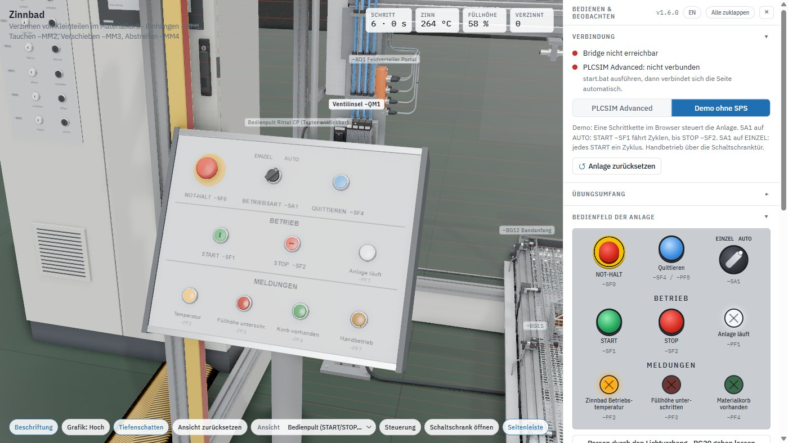
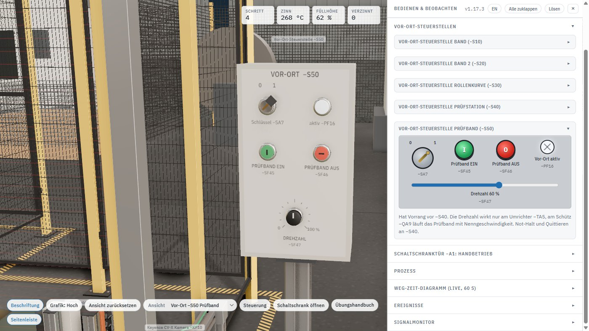
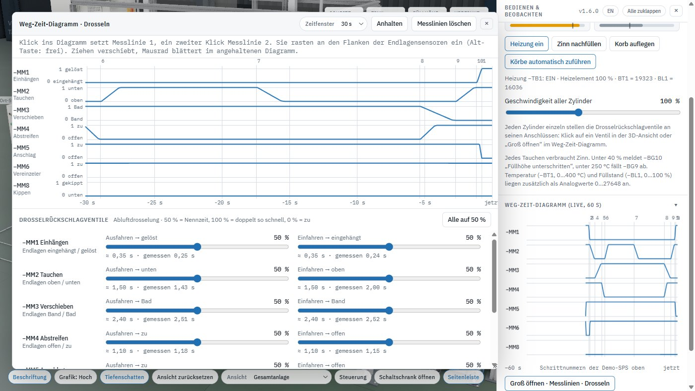
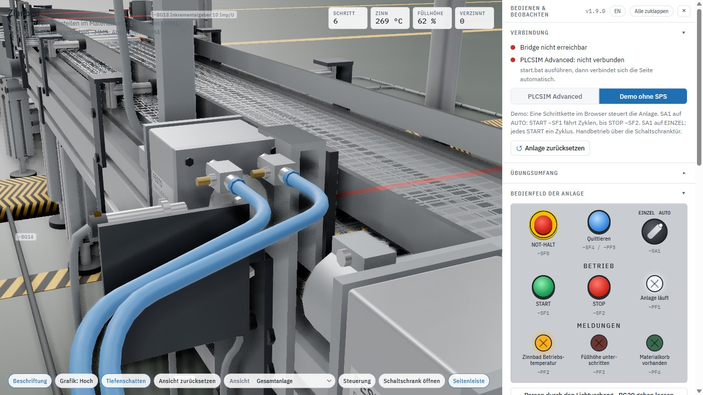

**Deutsch** · [English](03-bedienung.en.md)

# Bedienen

Jedes Befehlsgerät gibt es zweimal: als anklickbares Bauteil in der 3D-Szene und als Nachbau in der
Seitenleiste. Beide zeigen denselben Zustand und schreiben dieselben Eingänge.

[◀ Zurück zur Übersicht](../README.md)

## Befehlsgeräte und Steuerstellen

- **Bedienpult** (3D-Pult in der Szene und Seitenleiste): NOT-HALT −SF0, Quittieren −SF4 (blau, Leuchte −PF5 blinkt bei Quittierbedarf), Wahlschalter −SA1 **AUTO / EINZEL**, START −SF1, STOP −SF2 (Öffner), Meldeleuchten, BCD-Anzeige −PG1 (%QW6) und Daumenradschalter −SF48 für die Tauchzeit (%IW12, je Dekade + und −).
  - **AUTO:** START → die Anlage fährt Zyklus um Zyklus, bis STOP gedrückt wird. Der laufende Korb wird fertig.
  - **EINZEL:** jedes START fährt genau einen Zyklus.
- **Schaltschrank −A1 (Doppeltür):** links das Tableau Handbetrieb, rechts ein **SIMATIC HMI TP1200 Comfort** (−PF10, PROFINET an CPU X1 P2) mit Prozessbild (Betriebsart, Schritt, Zinnbad, Endlagen MM1…MM6, Band, Meldezeile). Innen: Kontaktelemente, Türkanal und Wellschlauch-Türübergang je Tür.
- **Tableau Handbetrieb (linke Tür):** Wahlschalter −SA3 **AUTO / HAND**, Leuchte −PF7 und je einem Taster pro Zylinderbewegung (−SF11…−SF18 für MM1…MM4 im Tippbetrieb, −SF19…−SF22 für MM5/MM6 und −SF28/−SF29 für MM8 mit Selbsthaltung, da monostabile Ventile). Alle Zylinder sind so von Hand fahrbar; die Rollenkurve −MA6 steht in HAND und wird nur über die Vor-Ort-Steuerstelle −S30 bedient. In HAND ruht die Schrittkette, und die Taster steuern die Ventilspulen im Tippbetrieb mit Verriegelungen (z. B. −MM3 nur mit angehobenem Korb, Lösen nur abgesenkt über dem Band).
- **Vor-Ort-Steuerstelle −S10** hinten am Bandanfang beim Antrieb −MA1 (außerhalb der Umhausung): Schlüsselschalter −SA2, Links −SF6 / Halt −SF7 / Rechts −SF5, Leuchte −PF6, NOT-HALT −SF8, Quittieren −SF41 (Leuchte −PF12).
- **Vor-Ort-Steuerstelle −S30** an der Rollenkurve: Schlüsselschalter −SA5, Links −SF31 / Halt −SF32 (Öffner) / Rechts −SF30, Leuchte −PF9, NOT-HALT −SF10, Quittieren −SF43 (Leuchte −PF14). Rechts/Links mit Selbsthaltung, gegenseitig verriegelt.
- **Vor-Ort-Steuerstelle −S40** an der Entleer- und Prüfstation (Bedienerseite zwischen Kipper und Ausschussbehälter, Blick auf Mulde, Rinne und Prüfband): Schlüsselschalter −SA6 (1 = Vor-Ort, die Automatik der Station ruht), Leuchte −PF11, Prüfung EIN −SF34 / AUS −SF35 (Öffner) für Vibrorinne + Prüfband mit Selbsthaltung, Muldenrollen ◀ −SF37 / ▶ −SF36 im Tippbetrieb (nur mit Kipper unten), KIPPEN −SF38 / KIPPER ZURÜCK −SF39 (5/2-Ventil monostabil, daher Selbsthaltung wie am Tableau; Kippen nur mit Korb am Endanschlag −BG33 oder ohne Korb an der Übergabe), NOT-HALT −SF33, Quittieren −SF44 (Leuchte −PF15). Leitung am Boden unter dem Prüfband in den Kabelkanal der Prüfstation und über die Kabelbrücke zum Schaltschrank.
- **Vor-Ort-Steuerstelle −S50** am Prüfband (Bedienerseite zwischen Ausschussbehälter und KLT): Schlüsselschalter −SA7 (1 = Vor-Ort, Vorrang vor −S40), Leuchte −PF16, Prüfband EIN −SF45 / AUS −SF46 (Öffner) mit Selbsthaltung, **Drehzahlpotentiometer −SF47** (0…100 %, analog auf %IW70). Die Drehzahl wirkt nur, wenn das Prüfband am Umrichter −TA5 läuft; am Schütz −QA9 fährt es mit Nenngeschwindigkeit. Im 3D-Modell dreht man den Knopf durch Ziehen (nach oben oder rechts = mehr) oder mit dem Mausrad in 5-%-Schritten, der Wert steht dabei neben dem Mauszeiger; in der Seitenleiste gibt es einen Schieberegler. Not-Halt und Quittieren an −S40 daneben.

  

- **Not-Halt:** −SF0 (Bedienpult), −SF8 (−S10), −SF9 (−S20), −SF10 (−S30) und −SF33 (−S40) wirken über das Sicherheitsrelais −KF2. Es schaltet die Ventile, die Schütze und die Heizung spannungsfrei, auch wenn die SPS noch Ausgänge setzt. Wieder frei erst nach Entriegeln **und** Quittieren: −KF2 gibt beim **Loslassen** des Quittiertasters frei (überwachter Start). Bandmodul und Portalsteuerung laufen danach erst mit **START −SF1** wieder an. −KF2_NotHalt_OK meldet den Zustand an die SPS.
  - **Meldekontakte:** Jeder Not-Halt-Taster hat zusätzlich einen Hilfskontakt (Öffner, drahtbruchsicher) auf einen normalen SPS-Eingang: `SF0_NotHalt_frei`, `SF8_NotHalt_frei`, `SF9_NotHalt_frei`, `SF10_NotHalt_frei`, `SF33_NotHalt_frei` (%I9.1…%I9.5, **1 = entriegelt**, 0 = betätigt). Die Abschaltung bleibt hart über −KF2. Ereignisliste und HMI-Meldezeile nennen den Taster, z. B. „NOT-HALT −SF9 (Band 2) – entriegeln und quittieren (−SF42)“.
  - **Quittiertaster:** −SF4 (Bedienpult), −SF41 (−S10), −SF42 (−S20), −SF43 (−S30), −SF44 (−S40) liegen parallel am Reset-Eingang von −KF2 – jeder quittiert. Jeder hat einen eigenen Eingang (`SF4_Quittieren`, `SF41_Quittieren_S10` … `SF44_Quittieren_S40`), die SPS sieht also, wo quittiert wurde („Not-Halt quittiert an −S20 (−SF42)“), und einen eigenen Leuchtmelder (−PF5, −PF12…−PF15), der bei Quittierbedarf blinkt.
- **Lichtvorhang −BG20:** Klick auf eine Lichtvorhangsäule (oder Knopf „Eingriff in den Lichtvorhang“) lässt einen Arm in das Schutzfeld greifen. −KF2 schaltet ab, Wiederanlauf erst bei freiem Schutzfeld und Quittieren −SF4. Eingang BG20_Lichtvorhang_frei %I4.7.
- **3D-Ansicht:** linke Maustaste ziehen = drehen, rechte Maustaste ziehen (oder Shift + links) = verschieben, Mausrad = zoomen, Doppelklick auf ein Bauteil = Drehpunkt dorthin. Die Legende blendet der Knopf „Steuerung“ ein und aus. Über „Ansicht“ fliegt die Kamera zu festen Sichten: Übersicht, Teilprozesse (Übergabeplatz, Portal, Zinnbad, Pneumatik, Rollenkurve, Kühlung, Kühlwassertank, Kipper, Prüfung, KLT) und Steuerstellen (Bedienpult, −S10, −S30, −S20, −S40).
- Alle Befehlsgeräte sind in der 3D-Szene anklickbar: Taster solange gedrückt, Not-Halt und Wahlschalter rasten.

## Weg-Zeit-Diagramm und Drosseln

- **Seitenleiste:** Das Weg-Zeit-Diagramm zeigt die letzten 60 s aller sieben Zylinder (−MM1…−MM6, −MM8),
  in der Demo mit den Schrittnummern. Stellung 1 = Kolbenstange ausgefahren.
- **Groß öffnen:** Der Knopf unter dem Diagramm (oder ein Klick auf ein Drosselventil in der 3D-Ansicht)
  öffnet ein eigenes Fenster. Es lässt sich am Kopf verschieben und an der Ecke unten rechts in der Größe
  ziehen; Esc schließt es.
  - **Zeitfenster** 5…120 s, **Anhalten** friert die Anzeige ein, das Mausrad blättert dann zurück.
  - **Messlinien:** Ein Klick setzt Linie 1, ein zweiter Linie 2, oben steht Δt. Die Linien rasten an
    den Flanken der Endlagensensoren des Zylinders unter dem Zeiger ein (mit gedrückter Alt-Taste
    frei), lassen sich ziehen und halten das Diagramm automatisch an.

- **Drosselrückschlagventile:** An jedem Zylinderanschluss sitzt eines (Abluftdrosselung: das Ventil an
  Anschluss B bremst das Ausfahren, das an A das Einfahren). Im Fenster ist jede Richtung jedes
  Zylinders einzeln einstellbar: 50 % = Nennzeit, 100 % = doppelt so schnell, **0 % = zu, der Zylinder
  steht** (gut zum Testen von Überwachungszeiten). Daneben stehen ein Richtwert und die zuletzt
  **gemessene Fahrzeit** – vom Verlassen des einen bis zum Erreichen des anderen Endlagensensors,
  also genau die Zeit, die auch dein SPS-Programm sieht. Die Einstellung bleibt im Browser
  gespeichert; „Alle auf 50 %“ stellt die Grundeinstellung wieder her. Der Regler „Geschwindigkeit
  aller Zylinder“ unter *Prozess* wirkt zusätzlich auf alle gemeinsam.

## Übungsumfang umschalten

| Umschalter | „automatisch“ | „SPS“ |
|---|---|---|
| **Verzinnen: Portal −MM1…−MM4** (Standard: SPS) | Die Portalsteuerung fährt die Schrittkette der Demo-SPS: einhängen, anheben, zum Bad, Abdeckung auf, tauchen, abtropfen, zurück, absetzen, lösen. Unabhängig von −SA1 fährt sie, sobald −KF2 frei ist und ein Korb an −BG40 anliegt, nach einem Not-Halt erst wieder nach START −SF1; −SA3 HAND schaltet auf die Tipptaster am Türtableau. Die Ausgänge −MB1…−MB8 deiner SPS sind ohne Wirkung (Signalmonitor: Quelle „Portal“). | Dein Programm schaltet −MB1…−MB8, Endlagen −BG1…−BG8. |
| **Band, Anschlag, Vereinzeler** (mit Rollenkurve und Band 2) | Das Bandmodul fördert, stoppt am Anschlag, vereinzelt und übergibt über die Rollenkurve auf Band 2 selbstständig. | Dein Programm steuert −QA1/−QA2 (Rechts-/Linkslauf), −MB9 Anschlag, −MB10 Vereinzeler, die Rollenkurve −QA10/−QA11, Band 2 (−QA5/−QA6, Kühlung), die Muldenrollen −QA12/−QA13 und die Prüfstation. Eingänge: −BG11…−BG13, −BG35/−BG36, −BG21…−BG24, −BG37/−BG33 (Kippmulde), Vor-Ort-Steuerstellen, −FA1/−FA5/−FA7/−FA8. |
| **Zinnbad Temperatur/Füllstand** | Der Regler am Bad hält 280 °C, Nachfüllen per Knopf. | Dein Programm schaltet −TB1 Heizung und −MB11 Nachfüllen. Istwerte −BT1/−BL1 analog. Ob 2-Punkt, Impuls/PWM oder PID_Compact – das entscheidet dein Programm. |
| **Kühlwassertank: Nachspeisung** | Der Niveauregler am Tank speist zwischen 55 und 75 % nach und sperrt die Pumpe −MA3 unter −BG38. | Dein Programm schaltet −MB17 und stellt −MB18 (%QW80). Istwerte −BL2 (%IW72) und −MB18 (%IW74) analog, Grenzschalter −BG38/−BG39. Zweipunkt oder PID_Compact – und den Trockenlaufschutz der Pumpe übernimmst du auch. |

**Portal automatisch, Band aus deinem Programm:** Die Portalsteuerung hebt und senkt am Übergabeplatz nur bei
offenem Anschlag (−BG15). Dein Programm stoppt das Band, wenn −BG40 meldet, öffnet −MB9 spätestens, wenn −BG1
„eingehängt“ meldet, und hält den Anschlag offen, bis der fertige Korb abgesetzt, gelöst (−BG2) und abgefahren ist
(−BG11 frei). Erst danach Anschlag zu und Vereinzeler auf. Solange der Haken im Korb ist, muss das Band stehen.

**Rezept: Tauch- und Abtropfzeit** stellst du unter *Prozess* ein (2…30 s, Standard je 10 s). Die Demo-SPS
und das Portal „automatisch“ halten diese Zeiten. Steuert dein Programm das Portal, sind es die Sollwerte, an
denen der Zwilling jeden Korb misst: kürzer getaucht oder abgetropft (0,5 s Toleranz) → „Korb mangelhaft“ und
öfter Ausschuss an der Prüfstation.

Regelstrecke Zinnbad: Heizelement PT1 (6 s) → Bad PT1 (150 s), 100 % Heizleistung ergibt 360 °C im Beharrungszustand, für 280 °C sind ca. 76 % nötig. Jedes Tauchen kühlt um 5 K und verbraucht 4 % Zinn. Analogwerte: 0…27648 = 0…400 °C bzw. 0…100 %.

Regelstrecke Kühlwassertank: integrierend (ohne Ausgleich). Zulauf bis 1,5 %/s bei −MB17 offen und −MB18 100 %, Regelventil mit 8 s Stellzeit. Verbrauch beim Sprühen ca. 0,3 %/s plus Verdampfung an heißen Körben, Ablasshahn ca. 1 %/s (nimmt mit sinkendem Pegel ab). Unter *Prozess* stehen Füllstand, Ventilstellungen, Zulauf und Verbrauch live; der Knopf *Ablasshahn öffnen* schaltet die Störgröße. Weitere Störgrößen darunter: *Motorschutz −FA1/−FA5/−FA7/−FA8 auslösen* (der Motor steht wirklich, der Hilfskontakt meldet 0) und *Drahtbruch −BT1/−BL1/−BT2/−BL2* (die Analogbaugruppe meldet 7FFF = 32767).

## Sprache

Oben in der Seitenleiste schaltet **EN / DE** zwischen englischer und deutscher Oberfläche um; die
Seite lädt dabei neu. Ohne gespeicherte Wahl richtet sich die Sprache nach dem Browser. Signalnamen,
Adressen und Betriebsmittelkennzeichen (−MM1, −BG5 …) bleiben in beiden Sprachen gleich, damit sie
zum TIA-Projekt passen.

## Grafik und Leistung

- Knopf **„Grafik: Auto“** unten in der 3D-Ansicht. *Auto* misst laufend die Bildrate und schaltet automatisch, damit es auf jeder Grafik flüssig läuft (Ziel 60 Bilder/s). Die gefundene Stufe wird gespeichert, beim nächsten Öffnen startet der Zwilling gleich damit. Durch Klicken lassen sich *Hoch*, *Mittel* und *Niedrig* fest einstellen.

| Stufe | Darstellung |
|---|---|
| Hoch | volle Materialien, bewegte Schatten |
| Mittel | einfache Beleuchtung, Schatten der festen Teile einmal vorberechnet, 85 % Auflösung |
| Niedrig | wie Mittel, 70 % Auflösung |
| (Auto zusätzlich) Minimal | ohne Schatten, 55 % Auflösung |

- Knopf **„Tiefenschatten“** daneben (hervorgehoben = an): Ambient Occlusion (GTAO) verschattet Ecken, Nuten, Spalten und
  die Bereiche unter Bändern und Geräten – deutlich plastischer. Kostet etwa eine zweite Szenendarstellung je Bild
  (Bildrate etwa halbiert); *Grafik: Auto* stellt dann gegebenenfalls eine Stufe niedriger. Standard: aus, der
  Zustand wird im Browser gemerkt. Durchsichtige Scheiben (Umhausung, Lichtvorhang) verschatten nicht.

- Für die beste Darstellung im Browser die starke Grafikkarte verwenden: Windows-Einstellungen → System → Anzeige → Grafik → Chrome/Edge → *Hohe Leistung*.

[◀ Zurück zur Übersicht](../README.md)
