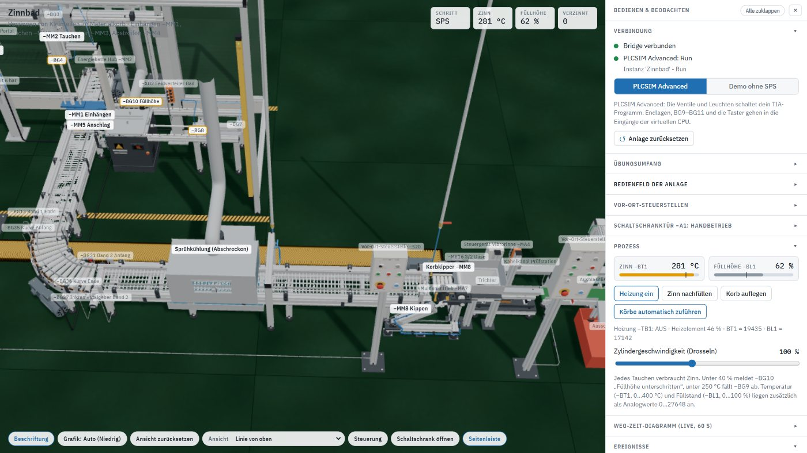
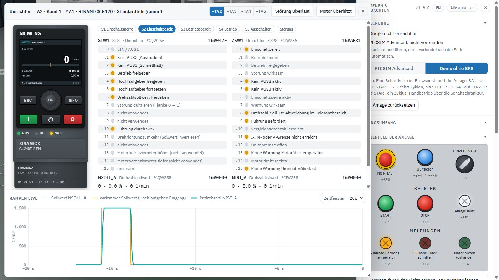
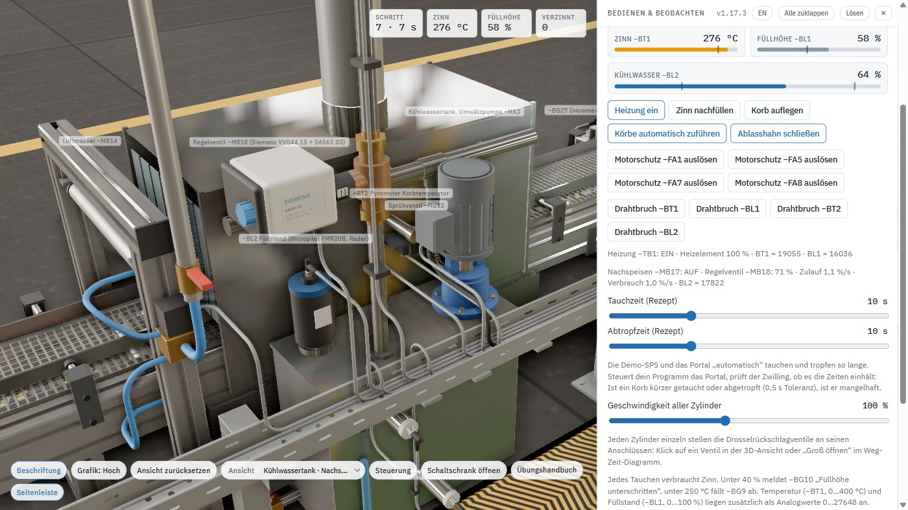

**Deutsch** · [English](04-signale.en.md)

# Signale und TIA-Anbindung

Der Zwilling kennt **186 Signale**: 121 Eingänge (davon 6 Analogwerte und 8 Telegrammwörter) und
65 Ausgänge (davon 1 Analogwert und 8 Telegrammwörter). Sie sind die
einzige Schnittstelle zwischen deinem Programm und dem Modell – kein proprietäres Protokoll, keine
Bausteinbibliothek, keine Lizenzdatei.

[◀ Zurück zur Übersicht](../README.md)



## Eine Datei, eine Wahrheit: `signale.csv`

```
Name;Adresse;Kommentar
SF1_Start;%I0.0;Taster START (Schliesser)
MB1_Einhaengen;%Q0.0;Einhaengezylinder -MM1: Korb einhaengen
BT1_Temperatur;%IW64;Zinntemperatur analog 0...27648 = 0...400 Grad C
```

- **Namen bleiben wie geliefert.** Der Zwilling erkennt jedes Signal an seinem Namen in dieser
  Datei. Das betrifft nur `signale.csv` – wie die Variablen in deinem TIA-Projekt heißen, ist frei,
  denn die Bridge schreibt und liest die SPS über die Adressen.
- **Adressen sind frei.** Passen die Adressen deiner Hardware-Konfiguration nicht, änderst du nur
  die mittlere Spalte – weder Bridge noch Browser müssen neu gebaut werden.
- **In Excel bearbeiten geht:** Kein Kommentar beginnt mit `-`, `+`, `=` oder `@` (Excel würde ihn
  als Formel lesen und `#NAME?` daraus machen), und kein Kommentar enthält ein Semikolon. Bei eigenen
  Kommentaren das Kennzeichen deshalb hinter den Begriff setzen („Tauchzylinder -MM2: senken“).
  Speichern als *CSV (Trennzeichen-getrennt)*, ohne Umlaute.
- Die Bridge liest die Datei beim Start und schickt die Liste an den Browser. Findet der Zwilling
  einen erwarteten Namen nicht, meldet er das in der Ereignisliste statt still falsch zu laufen.

## Adressbelegung

| Bereich | Adressen | Inhalt |
|---|---|---|
| Digitale Eingänge | `%I0.0 … %I11.7` | Endlagen, Lichtschranken, Taster, Wahl- und Schlüsselschalter, Motorschutz-Hilfskontakte, Not-Halt-Meldekontakte, Rückmeldung Sicherheitsrelais |
| Daumenradschalter −SF48 | `%I12.0 … %I13.7` (Wort `%IW12`) | Tauchzeit 000…999 s in BCD, je Dekade die Kontakte 8-4-2-1; 4. Baugruppe DI 32x24VDC HF ab `%I12.0`, in TIA mit Anfangsadresse 12 projektieren |
| Digitale Ausgänge | `%Q0.0 … %Q5.4` | Ventilspulen, Wendeschütze, Heizung, Pumpe, Vibrorinne, Prüfband, Ausblasdüse, Nachspeiseventil, Melde- und Leuchttaster |
| BCD-Anzeige −PG1 | `%Q6.0 … %Q7.7` (Wort `%QW6`) | dreistellige Ziffernanzeige am Bedienpult, je Stelle 8-4-2-1; eine Tetrade über 9 bleibt dunkel. Die Demo-SPS zeigt die Zahl der verzinnten Körbe |
| Analoge Eingänge | `%IW64 … %IW74` | Zinntemperatur −BT1 (0…400 °C), Füllstand −BL1 (0…100 %), Korbtemperatur −BT2 (0…400 °C), Drehzahlpotentiometer −SF47 an −S50 (0…100 %), Füllstand Kühlwassertank −BL2 (0…100 %), Stellungsrückmeldung Regelventil −MB18 (0…100 %) – jeweils 0…27648 |
| Analoge Ausgänge | `%QW80` | Stellwert Regelventil −MB18 (0…27648 = 0…100 %) |
| Umrichter −TA2…−TA5 (Telegramm 1) | `%QW256…270` / `%IW256…270` | je Umrichter STW1 und NSOLL_A hin, ZSW1 und NIST_A zurück – nur bei Antrieb „Umrichter“ |

## Was die Bridge tut

```
Browser  ──WebSocket──►  ZwillingBridge.exe  ──Runtime-API──►  virtuelle S7-1500
   Eingänge als Block                           WriteInputArea
   Ausgänge als Block  ◄──────────────────────  ReadOutputArea
```

- Prozessabbild **blockweise** statt Signal für Signal – ein Durchlauf je CPU-Zyklus.
- `start.bat` setzt die **Mindestzykluszeit** der virtuellen CPU (Vorgabe 10 ms). Der TIA-Standard von
  100 ms macht aus jedem Tastendruck bis zu 200 ms Verzögerung; mit 10 ms reagiert die Anlage sofort.
- Mehrere offene Registerkarten: nur die **zuletzt geöffnete im Modus PLCSIM** schreibt Eingänge,
  die anderen beobachten. Sonst würden sich zwei Zwillinge gegenseitig überschreiben und jedes Bit
  zappeln. Eine Registerkarte im Demo-Modus übernimmt die Steuerung nie.
- Verbinden darf sich nur der Zwilling selbst (über `http://localhost:<Port>` oder per Doppelklick
  geöffnet). Andere Webseiten im Browser weist die Bridge ab und meldet das in der Konsole.

## Umrichter und Technologieobjekt



Vier Förderer laufen wahlweise an ihren Schützen oder an einem **Frequenzumrichter** (SINAMICS
G120 an PROFINET). Umgeschaltet wird je Antrieb in der Seitenleiste unter *Übungsumfang → Antriebe*.
Die Umrichter sitzen im Schaltschrank −A1 unten rechts (je PM240-2 FSA mit CU240E-2 PN und
Bedienpanel IOP-2, Display und LEDs live, anklickbar).

| Umrichter | Antrieb | Schütze im Schützbetrieb | STW1 / NSOLL_A | ZSW1 / NIST_A | 16#4000 = 1500 1/min = |
|---|---|---|---|---|---|
| −TA2 | Band 1 −MA1 | −QA1/−QA2 | `%QW256` / `%QW258` | `%IW256` / `%IW258` | 100 mm/s |
| −TA3 | Band 2 −MA2 | −QA5/−QA6 | `%QW260` / `%QW262` | `%IW260` / `%IW262` | 120 mm/s |
| −TA4 | Rollenkurve −MA6 | −QA10/−QA11 | `%QW264` / `%QW266` | `%IW264` / `%IW266` | 110 mm/s |
| −TA5 | Prüfband −MA5 | −QA9 | `%QW268` / `%QW270` | `%IW268` / `%IW270` | 150 mm/s, nur vorwärts (p1110) |

100 % entsprechen jeweils der Geschwindigkeit am Netz mit Schütz. Am Prüfband ist die negative
Drehrichtung gesperrt, ein negativer Sollwert wirkt dort wie 0.

Wer einen Umrichter führt, hängt vom Übungsumfang ab:

- *Band: Bandmodul automatisch* (auch in der Demo): Das Bandmodul gibt ihm selbst das Telegramm.
- *Band: SPS steuert*: Dein Programm. Der Zwilling liest Steuerwort und Sollwert aus dem
  Ausgangsabbild und antwortet im Eingangsabbild mit Zustandswort und Istwert. Damit fährt ein
  **Technologieobjekt `TO_SpeedAxis`** (oder `SinaSpeed` aus der DriveLib) das Band genau so, wie es
  einen echten G120 fahren würde.
- **HAND** am Bedienpanel: Das Panel führt, das Telegramm der SPS ist ohne Wirkung (ZSW1.9 = 0).

**Telegramm:** SIEMENS-Standardtelegramm 1, PZD-2/2, je Umrichter vier Wörter (Beispiel −TA2):

| Wort | Richtung | Inhalt |
|---|---|---|
| `TA2_STW1` | SPS → Umrichter | Steuerwort 1, Betrieb typisch `16#047F`, AUS1 `16#047E` |
| `TA2_NSOLL_A` | SPS → Umrichter | Drehzahlsollwert, `16#4000` = 100 % = 1500 1/min, negativ = rückwärts |
| `TA2_ZSW1` | Umrichter → SPS | Zustandswort 1 |
| `TA2_NIST_A` | Umrichter → SPS | Drehzahlistwert, gleiche Normierung |

**Was nachgebildet ist:**

- Zustandsmaschine nach PROFIdrive: S1 Einschaltsperre → S2 Einschaltbereit (AUS1 = 0) →
  S3 Betriebsbereit (AUS1 = 1) → S4 Betrieb (STW1.3). Aus der Einschaltsperre geht es nur mit
  AUS1 = 0, wie am echten Gerät.
- AUS1 mit Rücklauframpe, AUS2 = Impulssperre (Band trudelt aus), AUS3 = Schnellhalt,
  Hochlaufgeber (STW1.4…6), Sollwertinvertierung (STW1.11), Führung durch SPS (STW1.10 = 0 →
  Telegramm wird ignoriert).
- Antriebsparameter: Bezugsdrehzahl p2000 = 1500 1/min, Maximaldrehzahl p1082 = 2250 1/min (150 %),
  Hoch- und Rücklaufzeit 0,3 s, AUS3-Rampe 0,1 s. Das eigentliche Fahrprofil kommt vom Technologieobjekt.
- **Not-Halt** wählt über −KF2 **STO** an: Impulse sofort gesperrt, LED SAFE blinkt, danach
  Einschaltsperre. Die Wendeschütze −QA1/−QA2 bleiben in dieser Betriebsart abgefallen.
- **Störungen** im Fenster des Umrichters: *Störung Überlast* (F30005, sofort quittierbar) und
  *Motor überhitzt* (Warnung A07910 mit ZSW1.7 = 1 und ZSW1.13 = 0, dazu Störung F07011, quittierbar
  erst nach dem Abkühlen). Quittiert wird mit einer Flanke an STW1.7, beim Technologieobjekt mit `MC_Reset`.
- **Feldbusüberwachung:** Geht PLCSIM in STOP oder bricht die Verbindung der Bridge ab, meldet jeder
  Umrichter, der sein Telegramm von der SPS bekommt, **F01910** (Feldbus-Sollwert-Timeout) und hält mit
  AUS3 an. Quittieren geht erst, wenn wieder Daten kommen. Die LED BF blinkt rot, solange kein Datenaustausch läuft.
- **STW1.10 = 0:** Der Umrichter ignoriert das Telegramm und arbeitet mit dem zuletzt übernommenen
  Steuerwort und Sollwert weiter. Ein Steuerwort `16#0000` hält einen laufenden Antrieb also nicht an.

**Fenster „Umrichter“** (Klick auf einen Umrichter im Schaltschrank oder Übungsumfang →
*Umrichter und Telegramme öffnen*, oben −TA2…−TA5 wählen): links die Gerätefront mit dem
Bedienpanel IOP-2, rechts beide Telegrammrichtungen Bit für Bit mit Bedeutung, unten **Rampen live**:
Sollwert NSOLL_A (gestrichelt), wirksamer Sollwert am Eingang des Hochlaufgebers (0 ohne Betrieb,
auf p1082 begrenzt) und Istdrehzahl über 10, 20 oder 60 s. Daran sieht man Hoch- und Rücklauf,
AUS1/AUS3 und das Austrudeln nach STO. Das Display zeigt dasselbe wie das Gerät im Schaltschrank.
Bedienen lässt sich das Panel so:

| Taste | Wirkung |
|---|---|
| HAND/AUTO (Hand-Symbol) | Führung zwischen Panel (HAND) und PROFINET (AUTO) umschalten, stoßfrei |
| I / O | in HAND einschalten bzw. AUS1 |
| Drehrad | in HAND Drehzahlsollwert (30 1/min je Raste), sonst Statusseiten blättern (Status, Istwerte, Telegramm); Mausrad, Pfeiltasten oder Klick auf den Rand |
| INFO | Störungen und Warnungen, dort **OK** (Mitte des Drehrads) = Quittieren |
| ESC | zurück zur Statusanzeige |

LEDs der CU240E-2 PN: **RDY** grün = bereit, rot = Störung; **BF** aus = Datenaustausch über
PROFINET, rot blinkend = kein Datenaustausch (keine Verbindung oder CPU in STOP); **SAFE** gelb = STO projektiert, gelb blinkend =
STO angewählt. Das Bedienpanel ist dem IOP-2 nachempfunden, die Menüs sind vereinfacht.

### Projektierung in TIA

1. **Umrichter einfügen:** In der Netzsicht je benutztem Antrieb einen SINAMICS G120 mit
   PROFINET-Control-Unit (z. B. CU240E-2 PN) an die CPU hängen, Gerätenamen vergeben (`ta2`…`ta5`;
   PROFINET-Gerätenamen erlauben nur Kleinbuchstaben, Ziffern, Bindestrich und Punkt, also kein „−TA2“).
2. **Telegramm:** In der Gerätesicht jedes Umrichters unter *Telegrammkonfiguration*
   **Standardtelegramm 1, PZD-2/2** wählen, E-/A-Adressen wie in der Tabelle oben (−TA2 256…259,
   −TA3 260…263, −TA4 264…267, −TA5 268…271). Andere Adressen gehen auch, dann in `signale.csv`
   die Zeilen `TA…_` anpassen und die Bridge neu starten.
3. **Technologieobjekt anlegen:** *Technologieobjekte → Neues Objekt hinzufügen → Motion Control →
   TO_SpeedAxis*. Unter *Konfiguration → Hardware-Schnittstelle → Antrieb* den G120 bzw. sein Telegramm 1 auswählen.
   **Simulation / virtuelle Achse nicht aktivieren** – sonst schreibt das Technologieobjekt kein
   Telegramm, und der Zwilling bekommt nichts zu sehen.
4. **Antriebsdaten von Hand eintragen:** Bezugsdrehzahl 1500 1/min, Maximaldrehzahl 2250 1/min
   (am Prüfband −TA5 nur positive Richtung).
   Unter *Hardware-Schnittstelle → Datenaustausch Antrieb* die automatische Übernahme der Antriebswerte online ausschalten, denn es gibt keinen echten
   Antrieb, aus dem sie kommen könnten.
5. **Programm:** `MC_Power` (Enable, StartMode = 1), `MC_MoveVelocity` (Velocity in 1/min,
   1500 1/min = 100 mm/s Bandgeschwindigkeit), `MC_Halt` zum Anhalten, `MC_Reset` zum Quittieren.
   Der Zustand der Achse steht im Technologieobjekt-DB (`StatusWord`, `ErrorWord`, `ActualSpeed`).

Die Bridge braucht dafür nichts Neues: Sie liest und schreibt Wörter schon immer. Sie muss nur mit
der aktuellen `signale.csv` gestartet werden, sonst kennt sie die Telegrammwörter nicht.

> **Hinweis zu PLCSIM Advanced:** Die Bridge schreibt das Telegramm direkt ins Prozessabbild der
> virtuellen CPU. Das Technologieobjekt arbeitet im Takt des OB MC-Servo, der Zwilling antwortet im
> Bridge-Zyklus (Vorgabe 10 ms). Für eine Drehzahlachse reicht das gut. Für eine Lageregelung
> wäre es zu träge.

## Kühlwassertank: Füllstand und Nachspeisung



Der Tank der Sprühkühlung (ca. 17 l) verliert beim Abschrecken Wasser: Sprühnebel und nasse Körbe
tragen es aus, heiße Körbe verdampfen zusätzlich. Nachgespeist wird über eine Frischwasser-Fallleitung
mit **Magnetventil −MB17** (2/2 NC, Absperrung, hinter −KF2) und **Regelventil −MB18** in Reihe. Wasser
fließt nur, wenn −MB17 offen ist; die Menge bestimmt −MB18 (bis 1,5 %/s bei 100 %). Der Stellantrieb
braucht 8 s für 0…100 % und meldet seine Stellung zurück.

| Gerät | Signal | Funktion |
|---|---|---|
| −BL2 Endress+Hauser **Micropilot FMR20B** (Radar 80 GHz, 4…20 mA) im Deckel | `BL2_Wasserstand` %IW72 | Füllstand stetig, 0…27648 = 0…100 % |
| −BG38 Endress+Hauser **Liquiphant FTL31** (Vibronik, PNP, MIN-Sicherheit) | `BG38_Wasser_Min` %I11.5 | 1 = Gabel bedeckt (über 25 %), Trockenlaufschutz der Pumpe −MA3 |
| −BG39 Endress+Hauser **Liquiphant FTL31** (Vibronik, PNP, MAX-Sicherheit) | `BG39_Wasser_Max_frei` %I11.6 | 1 = Gabel frei (unter 90 %), 0 = voll *oder* Drahtbruch |
| −MB17 Magnetventil Frischwasser | `MB17_Nachspeisen` %Q5.4 | Absperrung (stromlos zu) |
| −MB18 Regelventil Frischwasser | `MB18_Regelventil` %QW80, `MB18_Stellung` %IW74 | Stellwert und Stellungsrückmeldung, 0…27648 = 0…100 % |

Beide Grenzschalter arbeiten nach dem Ruhestromprinzip wie in der Praxis: Ein Drahtbruch meldet an
−BG38 „leer“ und an −BG39 „voll“ – beides ist die sichere Seite. Unter 8 % zieht die Pumpe Luft,
dann kommt kein Sprühwasser mehr. Der **Ablasshahn** am Tank (Seitenleiste *Prozess* oder Klick in
der 3D-Ansicht) ist eine Störgröße von ca. 1 %/s zum Testen der Regelung.

Im Übungsumfang *Niveauregler automatisch* speist der Tank zwischen 55 und 75 % selbst nach und
sperrt die Pumpe unter −BG38. Bei *SPS regelt* macht beides dein Programm. Die Demo-SPS zeigt
eine Lösung: PI-Regler auf 70 % über −MB18, −MB17 offen, solange der Regler Wasser fordert und
−BG39 frei ist, Pumpe −QA7 nur mit −BG38.

## Signalmonitor im Browser

Die Seitenleiste zeigt jedes Signal mit Name, Adresse und Live-Zustand. Jeder digitale Eingang lässt
sich auf **0** oder **1 forcen**. Damit prüfst du Verriegelungen und Fehlerwege, ohne die Anlage in
die passende Lage zu fahren. **A** gibt das Signal wieder ans Modell zurück. Analogwerte lassen sich
nicht forcen. Einen Drahtbruch an −BT1, −BL1, −BT2 oder −BL2 stellst du unter *Prozess* her, dann
meldet die Baugruppe 7FFF (32767). Im Betrieb liefern die Analogeingänge 0…27648, darüber bis 32511
die Übersteuerung.

Das Feld neben dem Filter stellt Wörter und Bytes als **Dez**, **Hex** (`16#…`) oder **Bin** (`2#…`)
dar. Mit **Bytes zeigen** steht über den Bits jedes Bytes eine Zeile `%IBn` bzw. `%QBn` mit dem
Bytewert, geforcte Bits eingeschlossen. So siehst du z. B. den Daumenradschalter in `%IB12`/`%IB13`
direkt als BCD.

## Schließer und Öffner

Drahtbruchsicher verdrahtet, also **1 = nicht betätigt**:

| Signal | Gerät |
|---|---|
| `SF2_Stop` | STOP Bedienpult −SF2 |
| `SF7_Band_Halt`, `SF25_B2_Halt`, `SF32_Kurve_Halt`, `SF35_Pruef_Halt`, `SF46_Pruefband_Aus` | Halt-Taster der Vor-Ort-Steuerstellen |
| `SF0/SF8/SF9/SF10/SF33_NotHalt_frei` | Meldekontakte der Not-Halt-Taster (1 = entriegelt) |
| `FA1/FA5/FA7/FA8_Motorschutz` | Hilfskontakte der Motorschutzschalter (1 = OK) |
| `KF2_NotHalt_OK` | Rückmeldung Sicherheitsrelais (1 = Freigabe) |
| `BG20_Lichtvorhang_frei` | Sicherheitslichtvorhang (1 = Schutzfeld frei) |
| `BG38_Wasser_Min`, `BG39_Wasser_Max_frei` | Grenzschalter Liquiphant am Kühlwassertank (1 = über Minimum bzw. unter Maximum) |

Erwartet dein Programm bei STOP einen Schließer, nimm im Bedienfeld den Haken
„STOP −SF2 als Öffner verdrahtet“ heraus.

## Demo ohne SPS

Ohne Bridge und ohne PLCSIM Advanced läuft im Browser eine Schrittkette mit, die die Anlage
selbstständig fährt. Sie ist kein Teil deiner Aufgabe, sondern ein Vergleichsmaßstab: Du siehst
jederzeit, wie sich die Anlage verhalten *soll* – Betriebsarten, Verriegelungen, Handshakes an den
Übergaben, Not-Halt und Quittierung. Umschalten in der Seitenleiste unter *Verbindung*.

Steht die Anlage beim START nicht in Grundstellung (nach Handbetrieb, Umschalten der Betriebsart
oder einem abgebrochenen Zyklus), fährt die Schrittkette zuerst zurück: Schritte 11–14 heben,
fahren zum Band und schließen das Bad, senken und lösen. Ein dabei abgelegter Korb fährt ab.

## Variablentabelle

Zwei Variablentabellen mit denselben 186 Signalen und denselben Adressen, zum Import in TIA
(PLC-Variablen → Rechtsklick → *Importieren*):

| Datei | Namen und Kommentare | Beispiel |
|---|---|---|
| `TIA/PLC_Variablen_Zinnbad.xlsx` | deutsch, Tabelle „Zinnbad“ | `MB1_Einhaengen`, `BG11_Korb`, `SF0_NotHalt_frei` |
| `TIA/PLC_Tags_Tinning_EN.xlsx` | englisch, Tabelle „Tinning“ | `MB1_HookIn`, `BG11_Basket`, `SF0_EStop_Released` |

Das Betriebsmittelkennzeichen steht in beiden Sprachen vorn, so passen Schaltplan, Zwilling und
TIA-Projekt zusammen. Die Zuordnung deutsch → englisch steht in `web/src/sprache/en-signalnamen.js`;
in der englischen Oberfläche zeigt der Signalmonitor die englischen Namen (der interne Name aus
`signale.csv` steht im Tooltip, die Suche findet beide).
