[Deutsch](07-uebungshandbuch.md) · **English**

# PLC Exercise Handbook (Übungshandbuch SPS-Technik)

The exercise handbook is the course that goes with the twin. In 37 exercises across four levels, it
takes you from the first signals to a line that runs entirely on your program. Every exercise
follows the same complete action cycle in six steps: inform, plan, decide, execute, check,
evaluate. You work directly in the browser, fill in your planning documents in ready-made templates
and test your program on the twin.

[◀ Back to overview](../README.en.md)

<table>
<tr>
<td width="50%">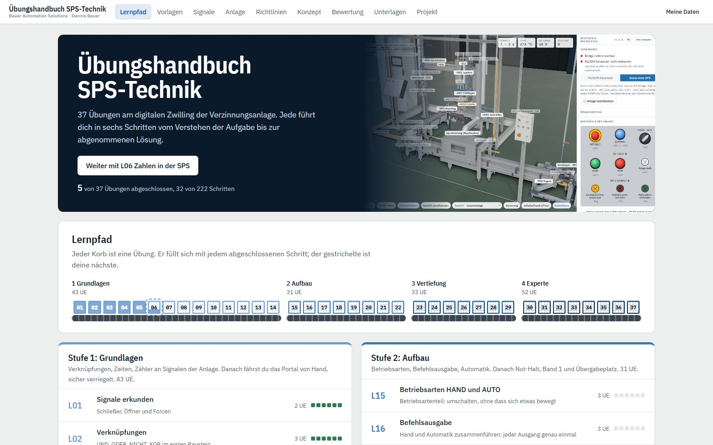</td>
<td width="50%">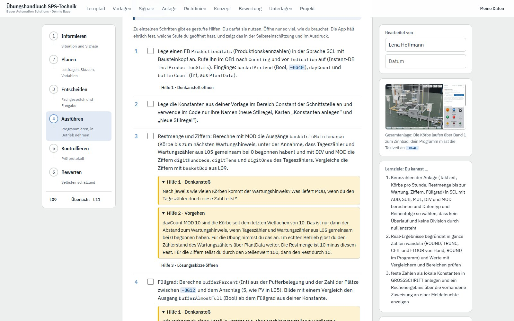</td>
</tr>
</table>

## Opening the handbook

The handbook is a single file: [`docs/uebungshandbuch.html`](uebungshandbuch.html). Double-click it
to open it in Chrome or Edge. No server, no installation and no internet connection required.
The page loads its images from `docs/bilder/`, so keep the file in the `docs` folder.

You can also open it from the twin: the **Exercise handbook** button at the bottom of the 3D view opens the
handbook in a new tab. This works when you double-click `web\index.html` and via the bridge (`http://localhost:8181`).

Alongside it, you run TIA Portal, PLCSIM Advanced, the bridge and the twin as usual
(see [01 Commissioning](01-inbetriebnahme.en.md)). The handbook itself does not talk to the PLC.
It tells you what to program, how to set up the twin and what to test.

**Your entries stay in your browser.** The handbook stores answers, checkmarks, completed templates,
tag tables and sketches locally. Under *My data* (Meine Daten), you save everything to a file to
hand it in or to continue on another computer, and load the file again there.

The handbook is currently available in German only.

## Learning path

The 37 exercises are arranged in four competence levels and build on each other:

| Level | Exercises | Guiding question |
|---|---|---|
| **Fundamentals** (Grundlagen) | L01 to L14 | What does the line report, and how do I move it safely by hand? |
| **Intermediate** (Aufbau) | L15 to L22 | How do I structure operating modes and automatic mode properly? |
| **Advanced** (Vertiefung) | L23 to L29 | How do I coordinate the conveyor line, the inspection station and the first control loops? |
| **Expert** (Experte) | L30 to L37 | How do I master continuous control, drives and the complete line? |

You start with logic operations, latches, edges, timers and counters, followed by numbers in the
PLC, data types, bit patterns, BCD, comparing and calculating, and analog values, always on real
signals of the line. After that, the plant program grows in the same order you would build it on a
real machine: **home position and release, manual mode, interlocks, operating modes, command
output, automatic mode.** This way you jog the gantry safely by hand before a step sequence is
added, and every output is written in exactly one place. Next come emergency stop diagnostics, the
conveyor line with its handovers, monitoring times, closed-loop control and drive technology.
Finally, in the capstone project L37, your team merges your programs into the complete line.

What you build in one exercise carries over into the next. Each exercise shows which blocks and
documents you bring along from previous exercises and which ones you create, extend or rework.
The result is one consistent plant program rather than a collection of isolated solutions (see
[Your project grows with you](#my-documents-and-your-project-grows-with-you)).

## Six steps per exercise

<table>
<tr>
<td colspan="2">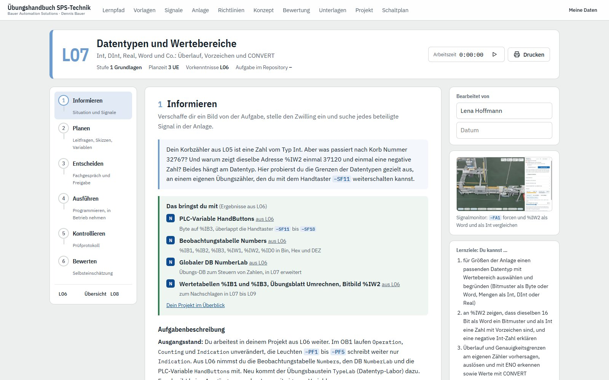</td>
</tr>
</table>

| Step | What you do |
|---|---|
| **1 Inform** | Read the situation and task description, look up the background knowledge, see what you bring along from earlier exercises, set the twin to the matching exercise scope, locate every signal involved in the line, entry check |
| **2 Plan** | Answer the guiding questions in writing, fill in the templates, draw the sequence and circuits in the sketch templates, create the tag table |
| **3 Decide** | Present your approach in a technical discussion, justify the alternative you rejected, get approval from the instructor |
| **4 Execute** | Program in TIA Portal, download to PLCSIM Advanced, commission on the twin, enter measurements and observations in the templates, check off each work step |
| **5 Check** | Work through the test record case by case, provoke faults deliberately by forcing, answer the review questions, style check according to the Siemens programming style guide |
| **6 Evaluate** | Self-assess the learning objectives, final check, see what you take along into the next exercises, close the exercise |

Your progress is always visible: on the learning path, each exercise fills up with every step you
complete, 222 steps in total. A step only counts as complete once everything in it has been worked
through. A failed test case only counts once you have recorded the cause, the change and the retest.

## Fill-in templates

<table>
<tr>
<td width="50%">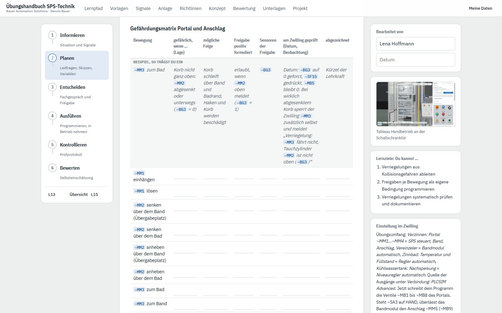</td>
<td width="50%">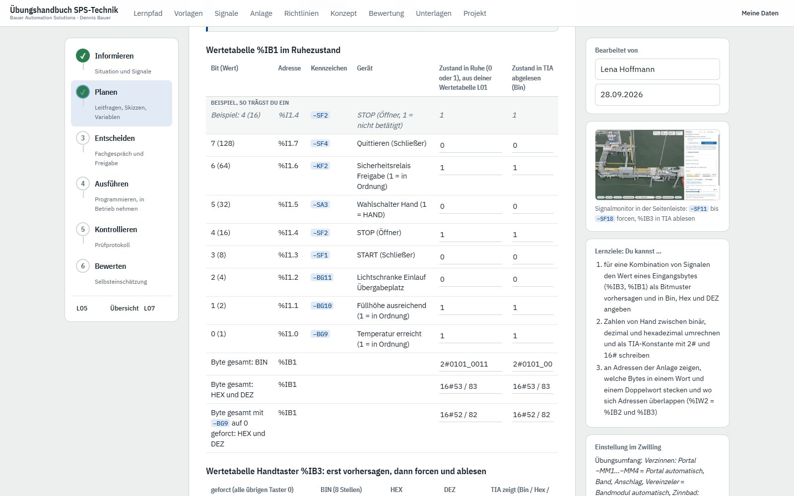</td>
</tr>
<tr>
<td colspan="2">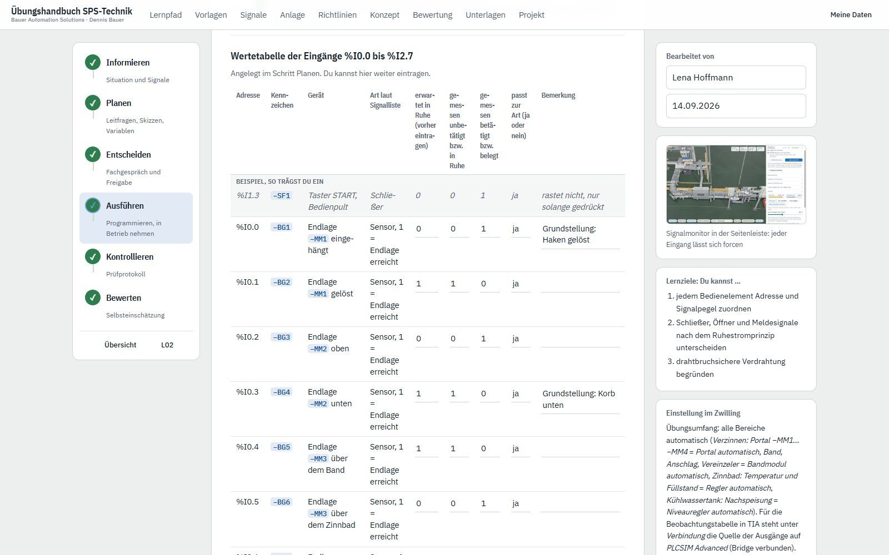</td>
</tr>
</table>

You fill in many documents directly in the handbook: value tables, function tables, block
interfaces, a hazard matrix, measurement records. Whatever is already fixed, such as address and
device tag, is prefilled. A grey **sample row** above the empty rows shows you how to fill them in.
It also appears on the blank printout, but not on the printout with your entries.

Each template belongs to one step and stays editable in the later steps of the exercise. For
example, you enter what you expect during planning and what you measure during execution. Some
documents carry on across many exercises, such as the output list (Ausgangsliste)
or the `PlantData` tag list: the rows from earlier exercises are shown read-only at the top, your
new rows below. If an exercise needs an earlier document, it shows it to you with a link to the
exercise where you edit it.

## Built-in support

**Background knowledge: the why behind it.** Each exercise comes with expandable explanations of
the background, with references. The programming rules are based on the Siemens Programming
Guideline and Programming Style Guide for S7-1200/S7-1500, the technical content on the relevant
standards such as IEC 61131-3, IEC 60848 (GRAFCET) and IEC 60204-1.

**Tiered hints.** Difficult work steps come with hints in up to three levels: first nudge, approach,
solution outline. Each level only opens after the previous one, so you reveal only as much as you
need. The handbook honestly records which level you used and shows it in the self-assessment and
on the printout.

**Quick checks.** At the start of an exercise, an entry check tests whether the prior knowledge
from earlier exercises is in place. At the end, a final check transfers what you have learned.
Every answer gets immediate feedback with an explanation.

<table>
<tr>
<td colspan="2">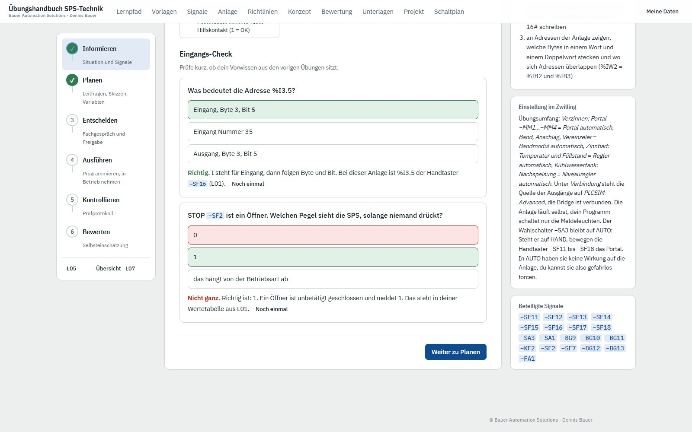</td>
</tr>
</table>

**Siemens programming style.** The guidelines page summarizes the rules all exercises are
programmed by: identifiers, block structure, interfaces, SCL style. The chapter *Siemens
programming style* (Programmierstil nach Siemens) lists each rule individually, with its rationale
and the exercise from which it applies. This way the style check grows with you: the Check step and
the printed test record only list the rules introduced so far, and new rules are highlighted.

**Signals and the line.** The signals page lists every tag from `signale.csv` with its address,
meaning and the exercises that use it. Hover over a device tag such as −MM1 in the text to see at
once what it stands for. The plant page describes the process, drives, control stations and safety
concept.

## My documents and Your project grows with you

<table>
<tr>
<td width="50%">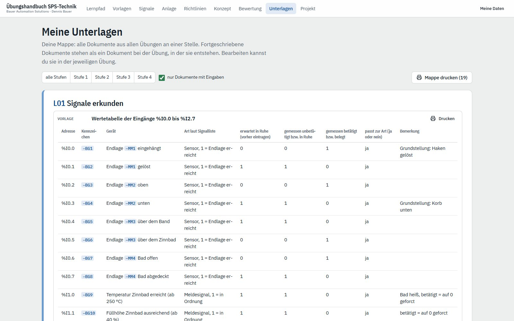</td>
<td width="50%">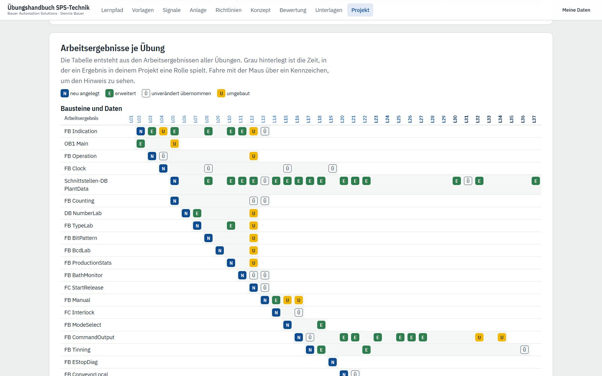</td>
</tr>
</table>

**My documents** (Meine Unterlagen) is your portfolio: every document from every exercise in one
place, including completed templates, test records, answers to guiding and review questions, tag
tables and sketches. You can filter by level or show only documents with entries, expand each
document, and print it on its own or the whole portfolio at once. A document that carries on across
exercises appears once, under the exercise where it was created. You edit it in the respective
exercise.

**Your project grows with you** (Dein Projekt wächst mit). From L01 to L36, your project grows
in one single TIA Portal project. In L37, your team merges its projects. The project page sets out the rules: a project archive with
the exercise number after every exercise, a change log in the block header, exactly one write
location per output, and data exchange via the block interfaces or the global DB `PlantData`. A
table shows for every block and document in which exercise it is created, extended, carried over
unchanged or reworked. Each exercise shows the same information in the Inform step under "What you
bring along" (Das bringst du mit) and in the Evaluate step under "What you take along" (Das nimmst
du mit).

## Sketch editor

<table>
<tr>
<td width="50%">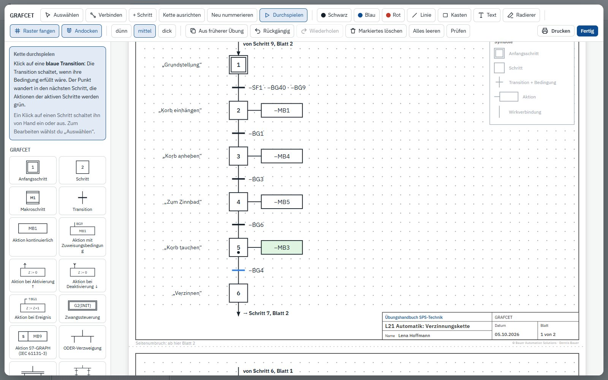</td>
<td width="50%">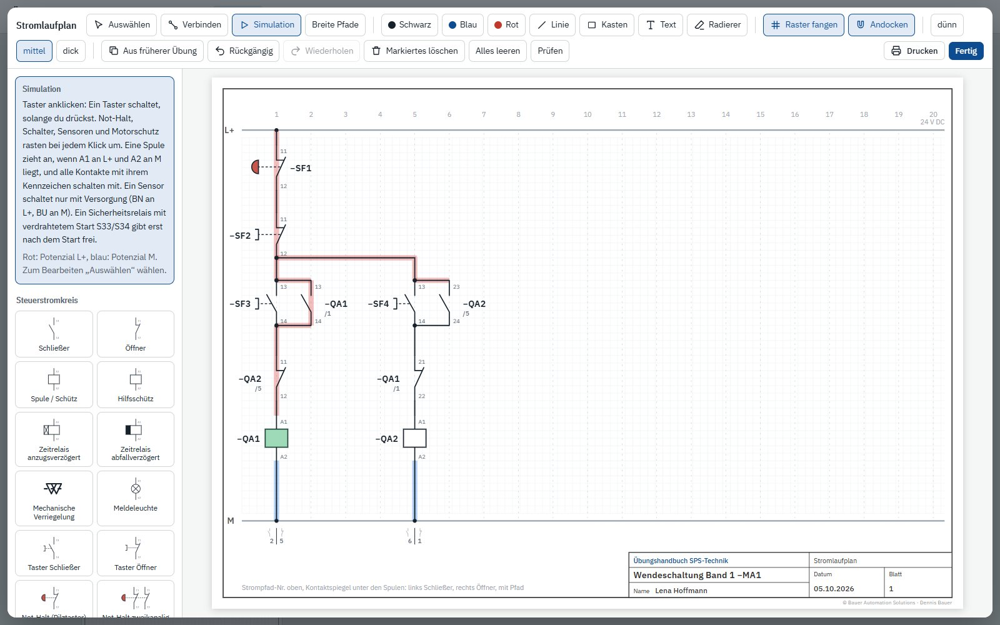</td>
</tr>
</table>

In the Plan step, you draw directly in standard-compliant templates with a title block, using a
mouse, pen or finger. The symbols are ready in a parts bar. You drag them onto the sheet, where they
snap to their neighbors and connect into clean diagrams.

| Template | Content |
|---|---|
| **GRAFCET** | Sequence to IEC 60848 with steps, transitions, actions and branches; align, renumber and play through the sequence |
| **State diagram** | States and transitions, e.g. for handovers and drives |
| **Displacement-step diagram** | Cylinder movements across the steps, also via quick entry such as "MM2−, MM3+, t = 10 s" with the end-position sensors of the line |
| **Circuit diagram** | Control circuit between L+ and M with pushbuttons, emergency stop, PLC modules and safety relay, with simulation |
| **Main circuit** | L1, L2, L3, N, PE with contactors, reversing contactor circuit, motor protection, motors and inverter |
| **Pneumatic circuit diagram** | Cylinders, directional, flow control and non-return valves to ISO 1219, with the drives of the line and with simulation |
| **Control loop** | Block diagram of controller, final control element, process and measuring element, with a sample to adopt and a small time-based simulation |
| **Trend recording** | Actual value, setpoint and manipulated variable over time |
| **Grid paper** | 5 mm grid for everything else |

<table>
<tr>
<td width="50%">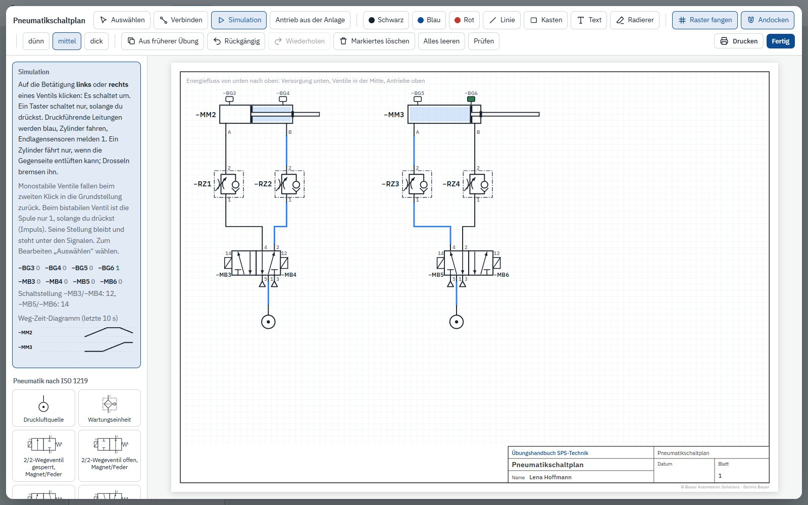</td>
<td width="50%">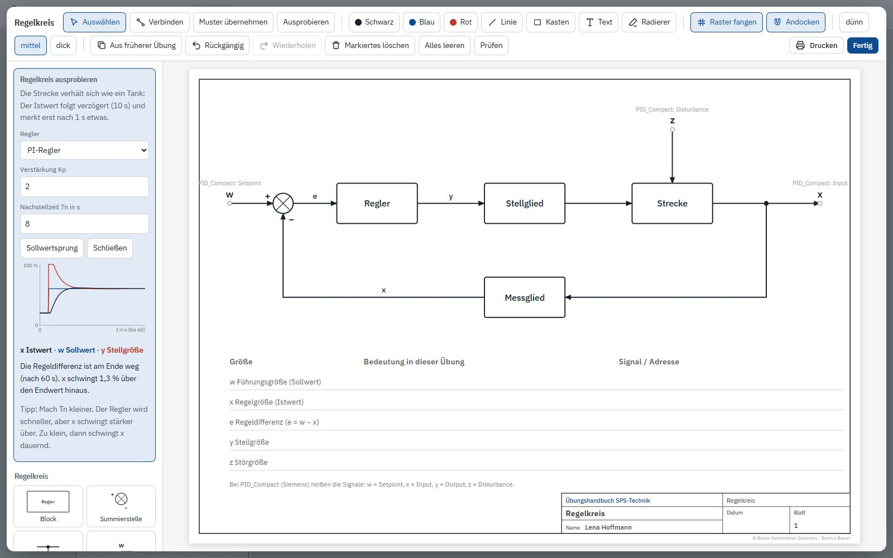</td>
</tr>
</table>

**Play-through and simulation.** You play through your GRAFCET sequence before you program it
(Play through, Durchspielen): clicking a blue transition fires it, the token moves on to the next
step, and the actions of the active steps turn green. In the circuit diagram, you press the
pushbuttons in the simulation and see which coils pick up and where current flows, with L+ in red
and M in blue. This lets you verify the latching and the mutual interlock of a reversing contactor
circuit on paper. In the pneumatic circuit diagram, you switch the valves and watch how compressed
air and cylinders respond. Non-return valves, shuttle valves (OR) and two-pressure valves (AND)
behave correctly, and a live displacement-time diagram records the movements of the drives. In the
control loop, you choose a P or PI controller under *Try it out* (Ausprobieren), set Kp and Tn and
watch how the actual value and the manipulated variable respond to a setpoint step.

**Drive from the line** (Antrieb aus der Anlage). In the pneumatic circuit diagram, one click
inserts a fully connected drive of the tinning line: cylinder with end-position sensors, 5/2-way
valve with solenoid coils, two one-way flow control valves for exhaust air throttling and the
compressed air supply, all with the device tags of the line.

**Check** (Prüfen). The *Check* button looks for typical mistakes in your drawing in the GRAFCET,
displacement-step diagram, circuit diagram and main circuit, pneumatic circuit diagram and control
loop. In the circuit diagram, for example, it reports open terminals, a contact without a coil or
a reversing contactor circuit without a mutual interlock.

Every sketch is saved and can be printed on its own, either blank for working on paper or with
your drawing. You can take over a drawing from an earlier exercise into the current one and develop
it further instead of starting from scratch. All templates are also available on a separate page,
independent of any exercise.

## Circuit diagram of the line (Schaltplan der Anlage)

<table>
<tr>
<td width="50%">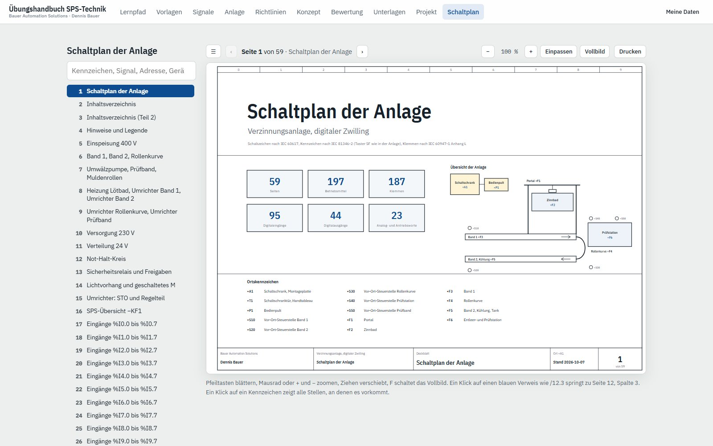</td>
<td width="50%">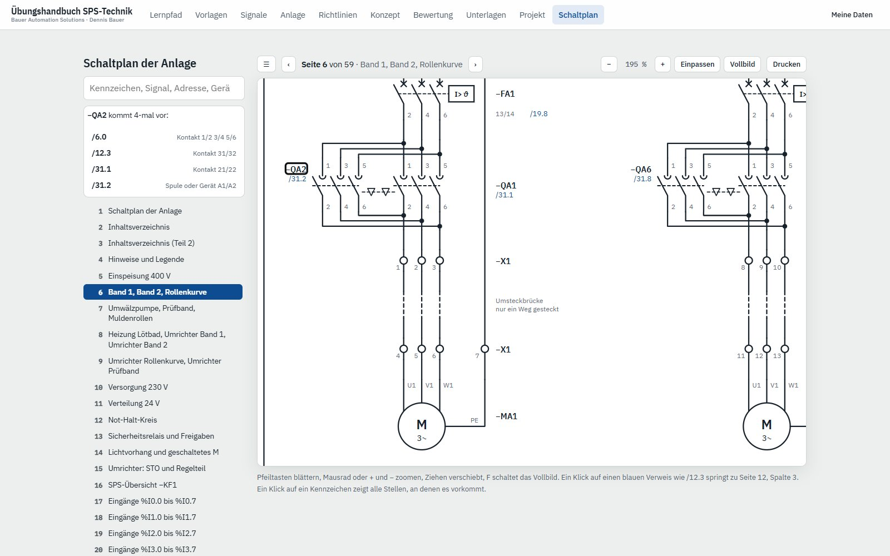</td>
</tr>
</table>

Under *Circuit diagram* (Schaltplan), you find the complete electrical circuit diagram of the
tinning line on almost 60 pages: cover sheet with an overview of the line and the location codes,
table of contents, power infeed and main circuits with the reversing contactor circuits of the
conveyors, power supply, emergency stop circuit and safety relay, PLC overview, every input and
output module as current paths, PROFINET, field distributors and valve terminals, plus the terminal
diagram, equipment list and PLC assignment list. The device tags are the same as in `signale.csv`,
in the TIA project and in the twin.

You page through with the arrow keys, zoom with the mouse wheel and search for a device tag, signal,
address or device. Clicking a cross-reference such as /12.3 jumps to page 12, column 3. Clicking a
device tag lists every place it appears, for example the coil and all contacts of a contactor. You
print on A3 or A4 landscape.

## Link to the twin

- **Same names everywhere.** All device tags follow IEC 81346 and are identical in the handbook,
  in `signale.csv`, in the TIA project and in the twin. You fill the tag table of an exercise from
  the signals involved at the click of a button.
- **Setting up the twin.** Every exercise names the matching exercise scope in the sidebar. The
  twin runs the part of the line you are not programming yet (see
  [05 Exercises](05-uebungen.en.md)).
- **Signal rally.** Before you program, you locate every signal involved in the signal monitor or
  in the 3D view and check it off.
- **Testing on the model.** In the test record, you provoke faults by forcing in the signal
  monitor, read the event log and measure travel times in the displacement-time diagram, for
  example to justify monitoring times.

## Printing and grading

For each exercise you print the sheets you need: worksheet, background knowledge, test record,
tag table, self-assessment, sketches and grading sheet, each with your entries or blank as a
template for working on paper. The grading page contains a grading sheet with points and a grade
on the German IHK scale. The **grading rubric** depends on the exercise type:

| Exercise type | Criteria (100 points in total) |
|---|---|
| **Programming** | Planning, function, fault behavior, program structure, documentation, technical discussion |
| **Exploring** | Planning, observation, analysis, documentation, technical discussion |
| **Design** | Planning, measurement and testing, calculation and design, implementation, documentation, technical discussion |
| **Project** | Planning and specification, function, fault behavior, program structure, documentation, individual contribution, technical discussion |

Each criterion describes four performance levels that match the four levels of the
self-assessment. A working program is the prerequisite, not the grade. The concept page describes
the teaching approach for instructors.

## At a glance

| | |
|---|---|
| **Target group** | Technical colleges, retraining, master craftsman and technician courses, automation technology apprenticeships |
| **Prerequisites** | Digital logic, number systems, basic electropneumatics |
| **Scope** | 37 exercises in four levels, 159 teaching units (UE) of 45 min in total, including the capstone project |
| **Tools** | TIA Portal V17 or later, S7-PLCSIM Advanced, twin with bridge |
| **Programming languages** | LAD/FBD, SCL, S7-GRAPH optional |
| **Handbook language** | German |

## For developers

The source code lives in `web/tools/uebungshandbuch/`: the page and the editor as ES modules under
`src/`, the exercises in `uebungen.js`, the detailed texts in `texte/`, the quick checks in
`quiz.js`. `node web/tools/uebungshandbuch/build.mjs` bundles everything together with
`signale.csv` into `docs/uebungshandbuch.html` and reports content issues as warnings.

[◀ Back to overview](../README.en.md)
