**Deutsch** · [English](07-uebungshandbuch.en.md)

# Übungshandbuch SPS-Technik

Das Übungshandbuch ist der Lehrgang zum Zwilling. In 37 Übungen und vier Stufen führt es dich von
den ersten Signalen bis zur Anlage, die vollständig an deinem Programm hängt. Jede Übung folgt
derselben vollständigen Handlung in sechs Schritten: informieren, planen, entscheiden, ausführen,
kontrollieren, bewerten. Du arbeitest direkt im Browser, füllst deine Planungsunterlagen in fertigen
Vorlagen aus und prüfst dein Programm am Zwilling.

[◀ Zurück zur Übersicht](../README.md)

<table>
<tr>
<td width="50%"></td>
<td width="50%"></td>
</tr>
</table>

## Öffnen

Das Handbuch ist eine einzige Datei: [`docs/uebungshandbuch.html`](uebungshandbuch.html). Öffne sie
per Doppelklick in Chrome oder Edge. Du brauchst keinen Server, keine Installation und kein Internet.
Die Bilder lädt die Seite aus `docs/bilder/`, lass die Datei deshalb im Ordner `docs`.

Aus dem Zwilling heraus geht es auch: Der Knopf **Übungshandbuch** unten im 3D-Bild öffnet das Handbuch
in einem neuen Tab. Das klappt per Doppelklick auf `web\index.html` und über die Bridge (`http://localhost:8181`).

Daneben laufen wie gewohnt TIA Portal, PLCSIM Advanced, die Bridge und der Zwilling
(siehe [01 Inbetriebnahme](01-inbetriebnahme.md)). Das Handbuch selbst spricht nicht mit der SPS.
Es sagt dir, was du programmierst, wie du den Zwilling einstellst und was du prüfst.

**Deine Eingaben bleiben in deinem Browser.** Antworten, Häkchen, ausgefüllte Vorlagen,
Variablenlisten und Skizzen speichert das Handbuch lokal. Unter *Meine Daten* sicherst du alles als
Datei, um es abzugeben oder an einem anderen Rechner weiterzuarbeiten, und lädst die Datei dort
wieder.

## Lernpfad

Die 37 Übungen sind in vier Kompetenzstufen geordnet und bauen aufeinander auf:

| Stufe | Übungen | Leitfrage |
|---|---|---|
| **Grundlagen** | L01 bis L14 | Was meldet die Anlage, und wie bewege ich sie sicher von Hand? |
| **Aufbau** | L15 bis L22 | Wie baue ich Betriebsarten und Automatik sauber auf? |
| **Vertiefung** | L23 bis L29 | Wie koordiniere ich Förderstrecke, Prüfstation und erste Regelkreise? |
| **Experte** | L30 bis L37 | Wie beherrsche ich stetige Regelung, Antriebe und die ganze Anlage? |

Am Anfang stehen Verknüpfungen, Speicher, Flanken, Zeiten und Zähler, dann Zahlen in der SPS,
Datentypen, Bitmuster, BCD, Vergleichen und Rechnen sowie Analogwerte, jeweils an echten Signalen
der Anlage. Danach entsteht das Anlagenprogramm in der Reihenfolge, in der man es auch an
einer realen Maschine aufbaut: **Grundstellung und Freigabe, Handbetrieb, Verriegelungen,
Betriebsarten, Befehlsausgabe, Automatik.** So fährst du das Portal zuerst sicher von Hand, bevor
eine Schrittkette dazukommt, und jeder Ausgang wird an genau einer Stelle geschrieben. Darauf folgen
Not-Halt-Diagnose, Förderstrecke mit Übergaben, Überwachungszeiten, Regelung und Antriebstechnik.
Zum Schluss führt ihr im Abschlussprojekt L37 im Team eure Programme zur Gesamtanlage zusammen.

Was du in einer Übung baust, nimmst du in die nächste mit. Jede Übung zeigt, welche Bausteine und
Unterlagen aus den vorigen Übungen du mitbringst und welche du neu anlegst, erweiterst oder
umbaust. Am Ende steht ein durchgängiges Anlagenprogramm statt vieler Einzellösungen (siehe
[Dein Projekt wächst mit](#meine-unterlagen-und-dein-projekt-wächst-mit)).

## Sechs Schritte je Übung

<table>
<tr>
<td colspan="2"></td>
</tr>
</table>

| Schritt | Was du tust |
|---|---|
| **1 Informieren** | Situation und Aufgabenbeschreibung lesen, Fachwissen nachschlagen, sehen, was du aus früheren Übungen mitbringst, den Zwilling auf den passenden Übungsumfang einstellen, jedes beteiligte Signal in der Anlage suchen, Eingangs-Check |
| **2 Planen** | Leitfragen schriftlich beantworten, Vorlagen ausfüllen, Ablauf und Schaltung in den Skizzenvorlagen zeichnen, Variablenliste anlegen |
| **3 Entscheiden** | Lösungsweg im Fachgespräch vorstellen, verworfene Alternative begründen, Freigabe durch die Lehrkraft |
| **4 Ausführen** | In TIA programmieren, in PLCSIM Advanced laden, am Zwilling in Betrieb nehmen, Messwerte und Beobachtungen in die Vorlagen eintragen, Arbeitsschritte abhaken |
| **5 Kontrollieren** | Prüfprotokoll Fall für Fall abarbeiten, Fehler durch Forcen gezielt provozieren, Kontrollfragen beantworten, Stil-Check nach Siemens-Programmierstyleguide |
| **6 Bewerten** | Lernziele selbst einschätzen, Abschluss-Check, sehen, was du in die nächsten Übungen mitnimmst, Übung abschließen |

Der Fortschritt ist immer sichtbar: Im Lernpfad füllt sich jede Übung mit jedem erledigten Schritt,
insgesamt sind es 222 Schritte. Ein Schritt gilt erst als erledigt, wenn alles darin bearbeitet ist.
Ein nicht bestandener Prüffall zählt erst, wenn du Ursache, Änderung und Nachtest festgehalten hast.
Der Übungskopf mit Kennung, Titel, Arbeitszeit und Drucken bleibt beim Scrollen oben stehen und wird
dabei schmal.

## Vorlagen zum Ausfüllen

<table>
<tr>
<td colspan="2">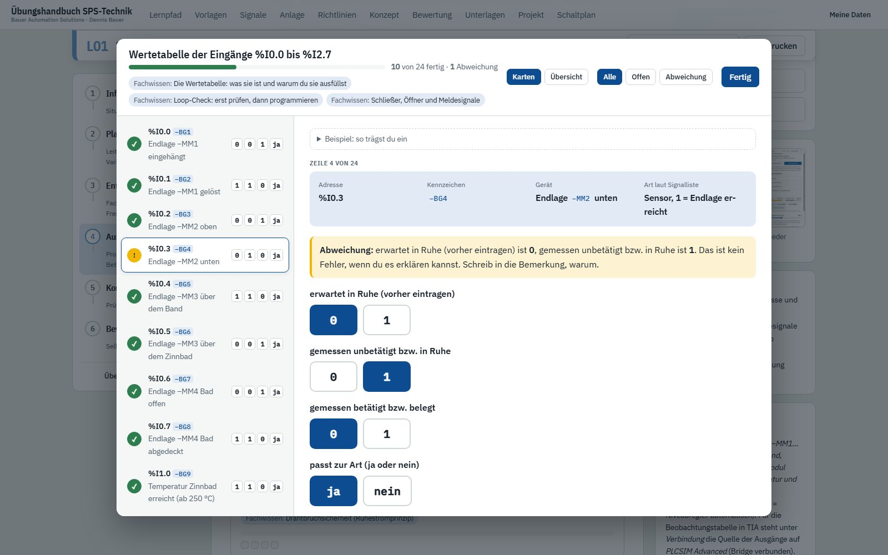</td>
</tr>
<tr>
<td width="50%">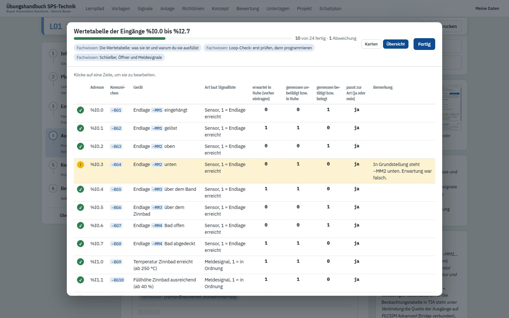</td>
<td width="50%">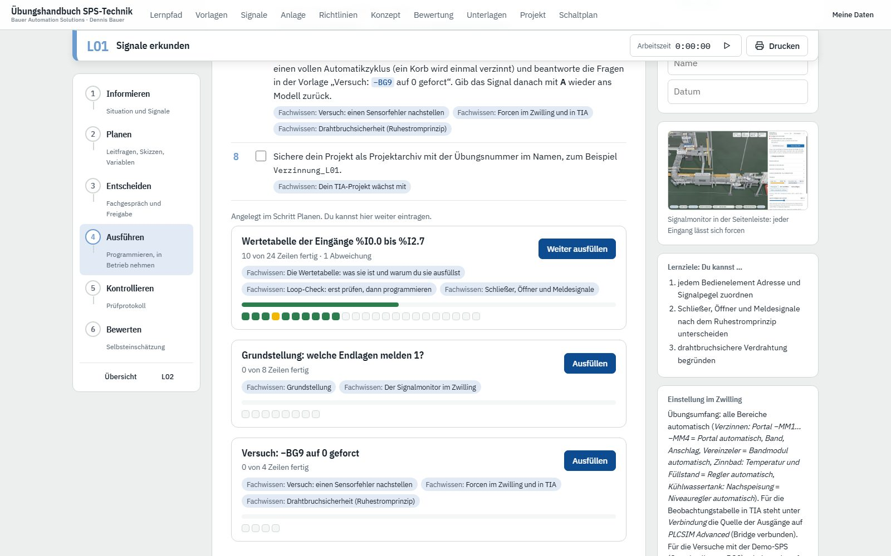</td>
</tr>
</table>

Viele Unterlagen füllst du direkt im Handbuch aus: Wertetabellen, Funktionstabellen, Schnittstellen
eines Bausteins, Gefährdungsmatrix, Messprotokolle. Im Schritt steht jede Vorlage als **Karte** mit
Fortschritt: wie viele Zeilen fertig sind, wo eine Abweichung steht, und ein Knopf **Ausfüllen**
bzw. **Weiter ausfüllen**.

Der Knopf öffnet die Vorlage als Popup. In der Ansicht **Karten** stehen links alle Zeilen, rechts
füllst du eine Zeile nach der anderen aus. Was schon feststeht, etwa Adresse, Kennzeichen und Gerät,
ist oben vorgegeben. Pegel trägst du mit großen Tasten **0** und **1** ein, Antworten mit **ja** und
**nein**, und die Vorlage springt danach von selbst weiter. Mit der Tastatur geht es auch: 0, 1, j, n
und die Pfeiltasten. Die Ansicht **Übersicht** zeigt die ganze Tabelle auf einen Blick, ein Klick auf
eine Zeile bringt dich zu ihrer Karte. Mit dem Filter **Offen** siehst du nur, was noch fehlt.

Passen zwei Einträge nicht zusammen, zum Beispiel erwartet 0 und gemessen 1, markiert die Vorlage
die Zeile gelb als **Abweichung** und bittet dich um eine Bemerkung. Eine Abweichung ist kein Fehler,
wenn du sie erklären kannst. Der Filter **Abweichung** zeigt nur diese Zeilen. **Beispiel: so trägst
du ein** zeigt dir eine ausgefüllte Musterzeile. Sie steht auch auf dem leeren Ausdruck, aber nicht
auf dem Ausdruck mit deinen Eingaben.

Eine Vorlage gehört zu einem Schritt und bleibt in den späteren Schritten der Übung bearbeitbar. So
trägst du zum Beispiel erst im Planen ein, was du erwartest, und im Ausführen, was du misst. Manche
Unterlagen schreibst du über viele Übungen fort, etwa die Ausgangsliste oder die Variablenliste
`PlantData`: Die Zeilen aus früheren Übungen stehen oben zum Lesen, deine neuen darunter. Braucht
eine Übung ein früheres Dokument, zeigt sie es dir mit einem Link in die Übung, in der du es
bearbeitest.

## Was dich unterstützt

**Fachwissen: warum, wieso, weshalb.** Zu jeder Übung gibt es aufklappbare Erklärungen zum
Hintergrund, mit Quellenangabe. Die Programmierregeln stützen sich auf den Programmierleitfaden und
den Programmierstyleguide von Siemens für S7-1200/S7-1500, die Fachinhalte auf die einschlägigen
Normen, etwa DIN EN 61131-3, DIN EN 60848 (GRAFCET) und DIN EN 60204-1. Viele Themen enthalten
[interaktive Erklärungen](#interaktive-erklärungen) zum Ausprobieren.

**Gestufte Hilfen.** Zu schwierigen Arbeitsschritten gibt es Hilfen in bis zu drei Stufen:
Denkanstoß, Vorgehen, Lösungsskizze. Jede Stufe öffnest du erst nach der vorigen, also nur so viel,
wie du brauchst. Das Handbuch hält ehrlich fest, welche Stufe du genutzt hast, und zeigt das in der
Selbsteinschätzung und im Ausdruck.

**Kurz-Checks.** Am Anfang einer Übung prüft ein Eingangs-Check, ob das Vorwissen aus den vorigen
Übungen sitzt. Am Ende überträgt ein Abschluss-Check das Gelernte. Jede Antwort bekommt sofort eine
Rückmeldung mit Begründung.

<table>
<tr>
<td colspan="2"></td>
</tr>
</table>

**Programmierstil nach Siemens.** Die Seite Richtlinien fasst die Regeln zusammen, nach denen alle
Übungen programmiert werden: Bezeichner, Bausteinaufbau, Schnittstellen, SCL-Stil. Das Kapitel
*Programmierstil nach Siemens* führt jede Regel einzeln mit Begründung und mit der Übung, ab der sie
gilt. Der Stil-Check wächst so mit dir: Im Schritt Kontrollieren und im gedruckten Prüfprotokoll
stehen nur die Regeln, die bis dahin eingeführt sind, neue Regeln sind markiert.

**Signale und Anlage.** Die Signalseite listet alle Kennzeichen aus `signale.csv` mit Adresse,
Bedeutung und den Übungen, in denen sie vorkommen. Fährst du über ein Kennzeichen wie −MM1 im Text,
siehst du sofort, was dahintersteckt. Die Anlagenseite beschreibt Prozess, Antriebe, Befehlsstellen
und Sicherheitskonzept.

## Interaktive Erklärungen

<table>
<tr>
<td width="50%">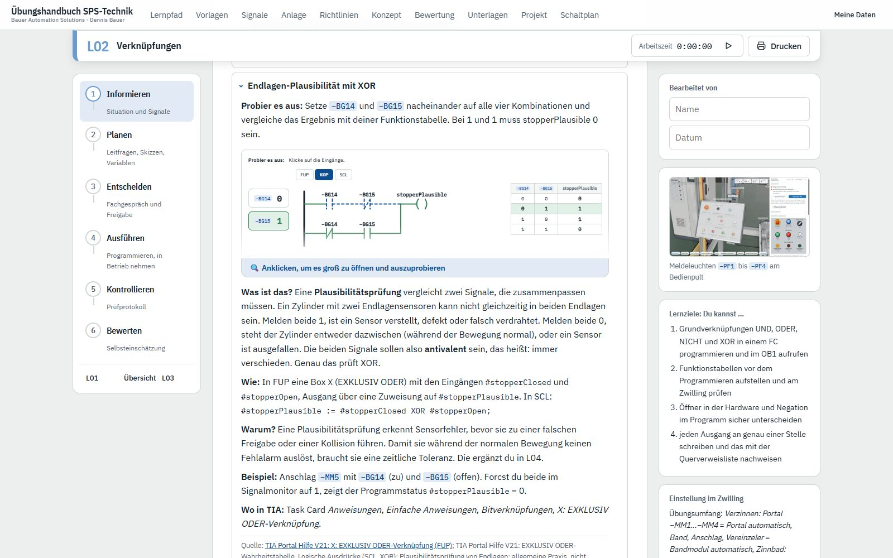</td>
<td width="50%">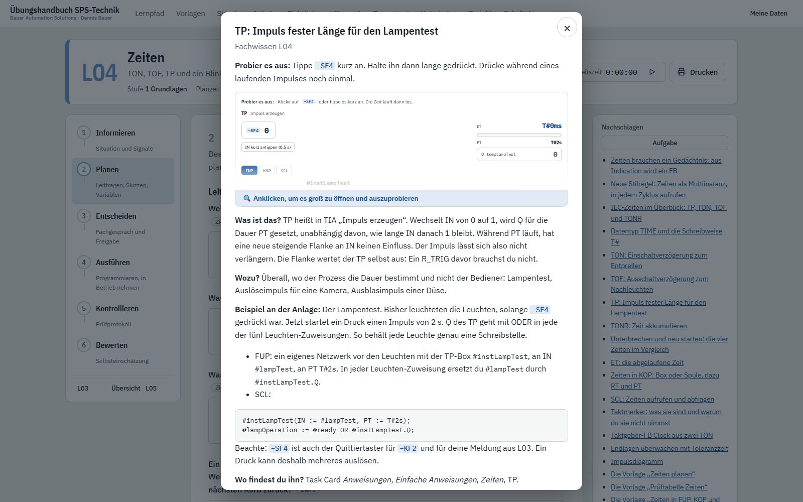</td>
</tr>
</table>

Was sich ausprobieren lässt, beschreibt das Fachwissen nicht nur, es zeigt es zum Anklicken. Du
schaltest Eingänge, spielst Zeiten ab oder änderst Bits und siehst sofort, was die CPU daraus macht:
FUP, KOP und SCL im Programmstatus wie in TIA, dazu Funktionstabelle, Signalverlauf oder
Impulsdiagramm und ein Satz, der das Ergebnis begründet. Unter *Begriffe* stehen die Fachwörter dazu.

**Vorschau und Popup.** Im Text steht jede Erklärung als kleine Vorschau, verkleinert und unten
ausgeblendet. Ein Klick darauf („Anklicken, um es groß zu öffnen und auszuprobieren“) öffnet sie
groß in einem Popup, und dort probierst du aus. **„← Zurück“** oben links, **„ד** oben rechts oder
Esc schließen das Popup, ein Klick daneben schließt nichts. Die Vorschau zeigt danach den letzten
Stand.

**Popup über Popup.** Im Schritt Informieren stehen alle Fachwissen-Themen zum Aufklappen im Text.
Ab dem Schritt Planen schlägst du ein Thema in der Seitenleiste *Nachschlagen* nach, es öffnet sich
als Popup. Die Erklärung legt sich darüber, und „← Zurück“ bringt dich genau dorthin zurück. Beim
Speicheraufbau gibt es eine dritte Ebene: „Speicheraufbau groß ansehen“.

<table>
<tr>
<td width="50%">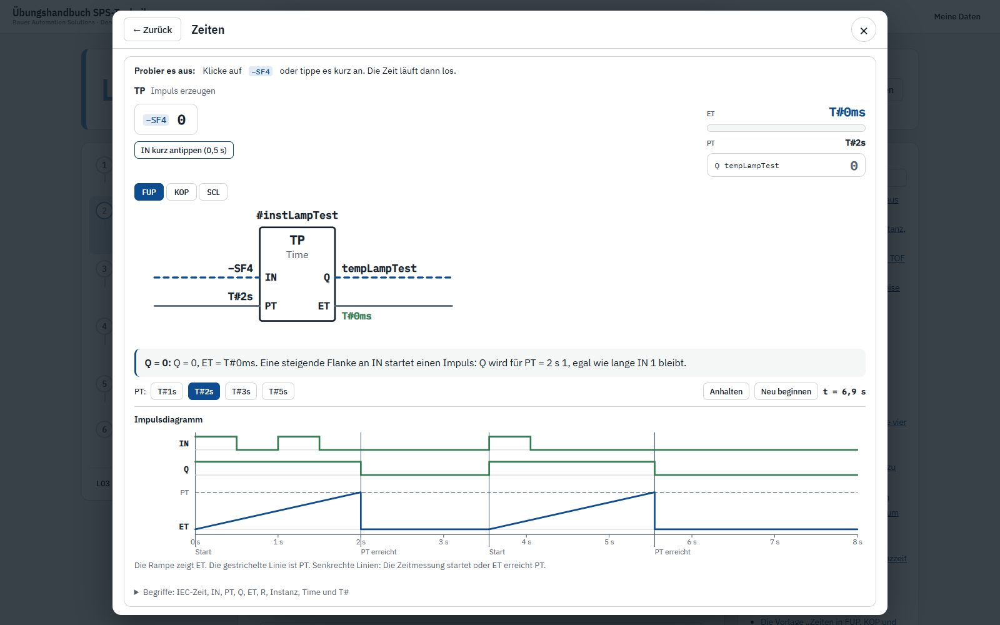</td>
<td width="50%">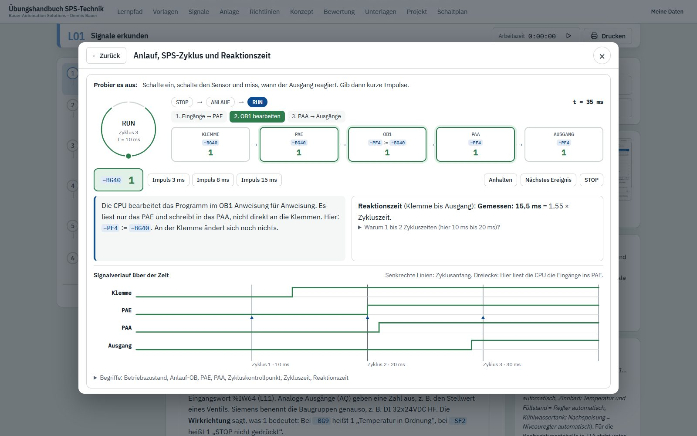</td>
</tr>
<tr>
<td width="50%">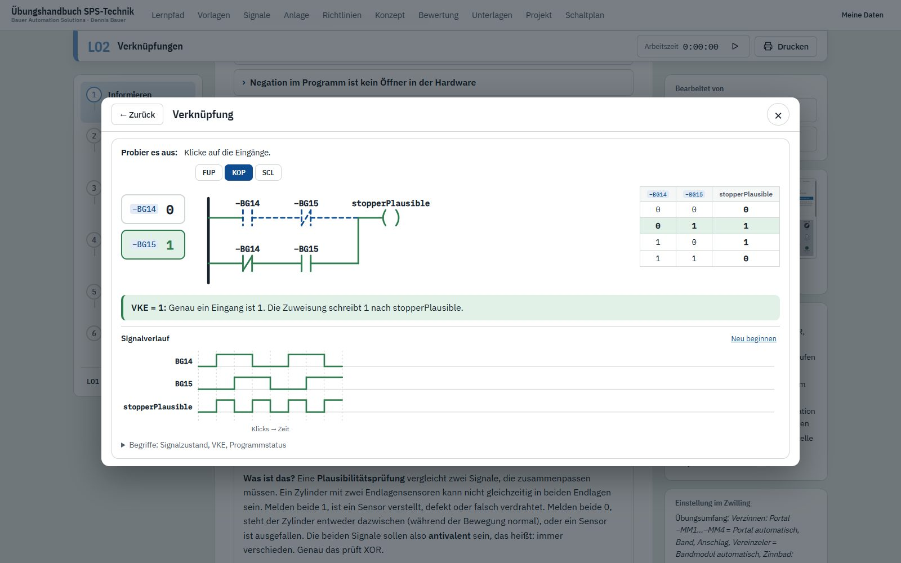</td>
<td width="50%">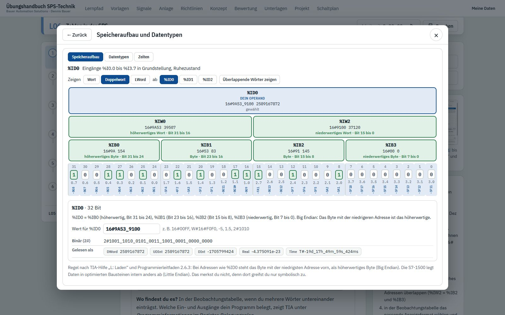</td>
</tr>
<tr>
<td width="50%">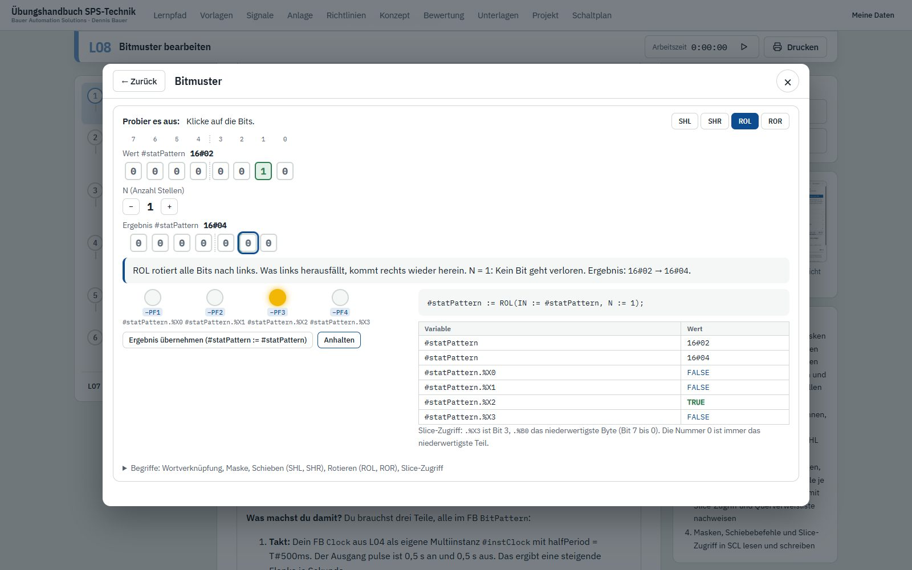</td>
<td width="50%">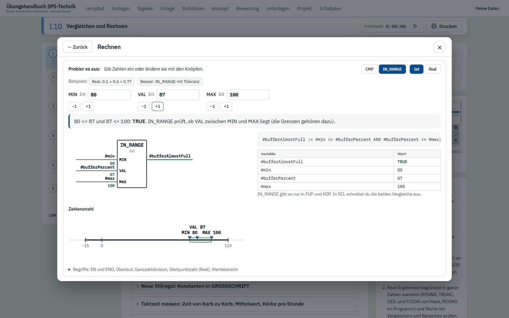</td>
</tr>
</table>

| Art | Was du ausprobierst | Erstmals in |
|---|---|---|
| **Zyklus** | STOP, ANLAUF und RUN, PAE, OB1 und PAA animiert, Zykluszeit, Reaktionszeit, kurze Impulse | L01 |
| **Logik** | UND, ODER, NICHT und XOR in FUP, KOP und SCL, Funktionstabelle, Signalverlauf | L02 |
| **Speicher** | SR- und RS-Box, Selbsthaltung, Setzen und Rücksetzen mit Spulen, Dominanz | L03 |
| **Flanke** | -\|P\|-, -\|N\|-, P_TRIG, N_TRIG, R_TRIG, F_TRIG Zyklus für Zyklus | L03 |
| **Zeit** | TP, TON, TOF und TONR mit Impulsdiagramm, ET und PT | L04 |
| **Zähler** | CTU, CTD und CTUD mit CU, CD, R, LD und PV | L05 |
| **Zahl** | Bits, Datentypen, Speicheraufbau von Doppelwort bis Bit, Zweierkomplement, Real, BCD | L05, L06, BCD in L09 |
| **Rechnen** | ADD bis MOD, Überlauf mit ENO, ROUND, CMP, IN_RANGE mit Zahlenstrahl | L07, L10 |
| **Bitmuster** | AND, OR und XOR mit Maske, Schieben und Rotieren, Lauflicht | L08 |

Jede Erklärung beginnt mit **„Probier es aus“**: Dort steht, was du anklicken sollst und worauf du
achtest. Was du hier siehst, prüfst du später am Zwilling.

## Meine Unterlagen und Dein Projekt wächst mit

<table>
<tr>
<td width="50%"></td>
<td width="50%"></td>
</tr>
</table>

**Meine Unterlagen** ist deine Mappe: alle Dokumente aus allen Übungen an einer Stelle, also
ausgefüllte Vorlagen, Prüfprotokolle, Antworten auf Leit- und Kontrollfragen, Variablenlisten und
Skizzen. Du filterst nach Stufe oder zeigst nur Dokumente mit Eingaben, klappst jedes Dokument auf
und druckst es einzeln oder die ganze Mappe. Ein fortgeschriebenes Dokument steht als ein Dokument
bei der Übung, in der es entsteht. Bearbeiten kannst du es in der jeweiligen Übung.

**Dein Projekt wächst mit.** Dein Projekt wächst von L01 bis L36 in einem einzigen TIA-Projekt.
In L37 führt ihr im Team eure Projekte zusammen. Die Seite Projekt nennt die Regeln dafür: Projektarchiv mit der Übungsnummer nach jeder
Übung, Änderungstabelle im Bausteinkopf, genau eine Schreibstelle je Ausgang, Datenaustausch über die
Bausteinschnittstellen oder den globalen DB `PlantData`. Eine Tabelle zeigt für jeden Baustein und
jede Unterlage, in welcher Übung sie neu angelegt, erweitert, unverändert übernommen oder umgebaut
wird. In jeder Übung steht dasselbe im Schritt Informieren unter „Das bringst du mit“ und im Schritt
Bewerten unter „Das nimmst du mit“.

## Skizzeneditor

<table>
<tr>
<td width="50%"></td>
<td width="50%"></td>
</tr>
</table>

Im Schritt Planen zeichnest du direkt in normgerechte Vorlagen mit Schriftfeld, mit Maus, Stift oder
Finger. Die Symbole liegen in einer Bausteinleiste bereit. Du ziehst sie aufs Blatt, sie docken an
ihre Nachbarn an und verbinden sich zu sauberen Plänen.

| Vorlage | Inhalt |
|---|---|
| **GRAFCET** | Ablauf nach DIN EN 60848 mit Schritten, Transitionen, Aktionen und Verzweigungen, Kette ausrichten, neu nummerieren und durchspielen |
| **Zustandsdiagramm** | Zustände und Übergänge, etwa für Übergaben und Antriebe |
| **Weg-Schritt-Diagramm** | Zylinderbewegungen über die Schritte, auch als Schnelleingabe wie „MM2−, MM3+, t = 10 s“ mit den Endlagensensoren der Anlage |
| **Stromlaufplan** | Steuerstromkreis zwischen L+ und M mit Tastern, Not-Halt, SPS-Baugruppen und Sicherheitsrelais, mit Simulation |
| **Hauptstromkreis** | L1, L2, L3, N, PE mit Schützen, Wendeschützschaltung, Motorschutz, Motoren und Umrichter |
| **Pneumatikschaltplan** | Zylinder, Wege-, Drossel- und Sperrventile nach ISO 1219, mit den Antrieben der Anlage und mit Simulation |
| **Regelkreis** | Blockschaltbild aus Regler, Stellglied, Strecke und Messglied, mit Muster zum Übernehmen und kleiner Zeitsimulation |
| **Trendaufzeichnung** | Istwert, Sollwert und Stellgröße über der Zeit |
| **Kästchenraster** | 5-mm-Raster für alles Weitere |

<table>
<tr>
<td width="50%"></td>
<td width="50%"></td>
</tr>
</table>

**Durchspielen und simulieren.** Deine GRAFCET-Kette spielst du durch, bevor du sie programmierst:
Ein Klick auf eine blaue Transition schaltet weiter, der Punkt wandert in den nächsten Schritt, und
die Aktionen der aktiven Schritte werden grün. Im Stromlaufplan drückst du in der Simulation die
Taster und siehst, welche Spulen anziehen und wo Strom fließt, L+ rot und M blau. So prüfst du
Selbsthaltung und gegenseitige Verriegelung einer Wendeschaltung schon auf dem Papier. Im
Pneumatikschaltplan schaltest du die Ventile und siehst, wie Druckluft und Zylinder reagieren.
Rückschlagventile, ODER- und UND-Ventile wirken dabei richtig, und ein mitlaufendes
Weg-Zeit-Diagramm zeichnet die Bewegungen der Antriebe auf. Im Regelkreis wählst du unter
*Ausprobieren* einen P- oder PI-Regler, stellst Kp und Tn ein und siehst nach einem
Sollwertsprung, wie Istwert und Stellgröße verlaufen.

**Antrieb aus der Anlage.** Im Pneumatikschaltplan setzt ein Klick einen Antrieb der
Verzinnungsanlage fertig verdrahtet ein: Zylinder mit Endlagensensoren, 5/2-Wegeventil mit Spulen,
zwei Drosselrückschlagventile in Abluftdrosselung und die Druckluftquelle, alles mit den
Kennzeichen der Anlage.

**Prüfen.** Der Knopf *Prüfen* sucht typische Fehler in deiner Zeichnung, im GRAFCET, im
Weg-Schritt-Diagramm, im Stromlaufplan und Hauptstromkreis, im Pneumatikschaltplan und im Regelkreis.
Im Stromlaufplan meldet er zum Beispiel offene Anschlüsse, einen Kontakt ohne Spule oder eine
Wendeschaltung ohne gegenseitige Verriegelung.

Jede Skizze wird gespeichert und lässt sich einzeln drucken, leer für die Arbeit auf Papier oder mit
deiner Zeichnung. Eine Zeichnung aus einer früheren Übung übernimmst du in die aktuelle und
entwickelst sie dort weiter, statt neu anzufangen. Alle Vorlagen gibt es zusätzlich auf einer
eigenen Seite, unabhängig von einer Übung.

## Schaltplan der Anlage

<table>
<tr>
<td width="50%"></td>
<td width="50%"></td>
</tr>
</table>

Unter *Schaltplan* findest du den vollständigen elektrischen Schaltplan der Verzinnungsanlage auf
knapp 60 Seiten: Deckblatt mit Übersicht der Anlage und Ortskennzeichen, Inhaltsverzeichnis,
Einspeisung und Hauptstromkreise mit den Wendeschaltungen der Bänder, Versorgung, Not-Halt-Kreis und
Sicherheitsrelais, SPS-Übersicht, jede Ein- und Ausgangsbaugruppe als Strompfade, PROFINET,
Feldverteiler und Ventilinseln sowie Klemmenplan, Betriebsmittelliste und SPS-Zuordnungsliste. Die
Kennzeichen sind dieselben wie in `signale.csv`, im TIA-Projekt und im Zwilling.

Du blätterst mit den Pfeiltasten, zoomst mit dem Mausrad und suchst nach Kennzeichen, Signal,
Adresse oder Gerät. Ein Klick auf einen Querverweis wie /12.3 springt zu Seite 12, Spalte 3. Ein
Klick auf ein Kennzeichen zeigt alle Stellen, an denen es vorkommt, etwa die Spule und alle
Kontakte eines Schützes. Gedruckt wird auf A3 oder A4 quer.

## Verbindung zum Zwilling

- **Gleiche Namen überall.** Alle Kennzeichen folgen EN 81346 und heißen im Handbuch, in
  `signale.csv`, im TIA-Projekt und im Zwilling gleich. Die Variablenliste einer Übung übernimmst du
  per Knopfdruck aus den beteiligten Signalen.
- **Zwilling einstellen.** Jede Übung nennt den passenden Übungsumfang in der Seitenleiste. Der
  Zwilling fährt den Teil der Anlage selbst, den du noch nicht programmierst (siehe
  [05 Übungsaufgaben](05-uebungen.md)).
- **Signal-Rallye.** Bevor du programmierst, suchst du jedes beteiligte Signal im Signalmonitor oder
  in der 3D-Ansicht und hakst es ab.
- **Prüfen am Modell.** Im Prüfprotokoll provozierst du Fehler durch Forcen im Signalmonitor,
  liest die Ereignisliste und misst Fahrzeiten im Weg-Zeit-Diagramm, etwa um Überwachungszeiten zu
  begründen.

## Drucken und Bewerten

Zu jeder Übung druckst du die Blätter, die du brauchst: Arbeitsblatt, Fachwissen, Prüfprotokoll,
Variablenliste, Selbsteinschätzung, Skizzen und Bewertungsbogen, jeweils mit deinen Eingaben oder
leer als Vorlage für die Arbeit auf Papier. Die Seite Bewertung enthält einen Bewertungsbogen mit Punkten
und Note nach IHK-Schlüssel. Das **Bewertungsraster** richtet sich nach dem Typ der Übung:

| Übungstyp | Kriterien (zusammen 100 Punkte) |
|---|---|
| **Programmieren** | Planung, Funktion, Fehlerverhalten, Programmstruktur, Dokumentation, Fachgespräch |
| **Erkunden** | Planung, Beobachtung, Auswertung, Dokumentation, Fachgespräch |
| **Auslegen** | Planung, Messung und Versuch, Berechnung und Auslegung, Umsetzung, Dokumentation, Fachgespräch |
| **Projekt** | Planung und Pflichtenheft, Funktion, Fehlerverhalten, Programmstruktur, Dokumentation, Einzelanteil, Fachgespräch |

Jedes Kriterium beschreibt vier Niveaustufen, passend zu den vier Stufen der Selbsteinschätzung.
Ein lauffähiges Programm ist die Voraussetzung, nicht die Note. Die Seite Konzept beschreibt den
didaktischen Aufbau für Lehrkräfte.

## Rahmen

| | |
|---|---|
| **Zielgruppe** | Fachschule Technik, Umschulung, Meister- und Technikerkurse, Ausbildung Automatisierungstechnik |
| **Voraussetzung** | Digitaltechnik, Zahlensysteme, Grundbegriffe Elektropneumatik |
| **Umfang** | 37 Übungen in vier Stufen, zusammen 159 UE à 45 min einschließlich Abschlussprojekt |
| **Werkzeuge** | TIA Portal ab V17, S7-PLCSIM Advanced, Zwilling mit Bridge |
| **Sprachen** | KOP/FUP, SCL, S7-GRAPH optional |
| **Sprache des Handbuchs** | Deutsch |

## Für Entwickler

Der Quelltext liegt in `web/tools/uebungshandbuch/`: die Seite und der Editor als ES-Module unter
`src/`, die Übungen in je einem eigenen Ordner `uebungen/L01/` bis `uebungen/L37/` (Stammdaten
`uebung.js`, ausführliche Texte `texte.json`, Kurz-Checks `quiz.js`). `node web/tools/uebungshandbuch/build.mjs` bündelt alles mit `signale.csv` zu
`docs/uebungshandbuch.html` und meldet inhaltliche Auffälligkeiten als Warnung.

[◀ Zurück zur Übersicht](../README.md)
